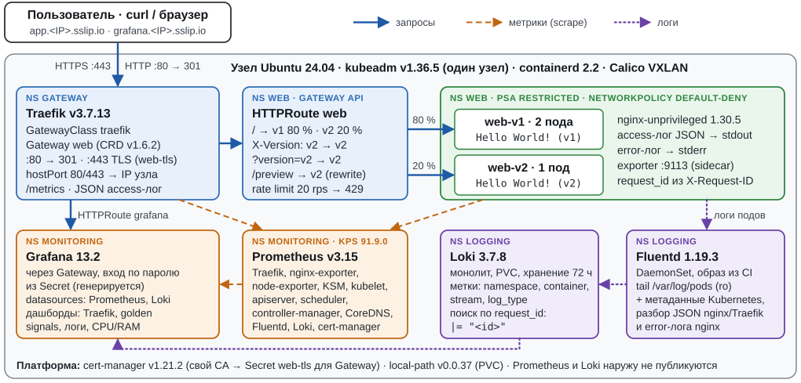

# kube-gateway-stand

[](https://github.com/DverkuOff/kube-gateway-stand/actions/workflows/lint.yml)
[](https://github.com/DverkuOff/kube-gateway-stand/actions/workflows/e2e.yml)
[](https://github.com/DverkuOff/kube-gateway-stand/actions/workflows/image.yml)

Одна команда превращает чистую Ubuntu 24.04 в кластер Kubernetes (kubeadm), в котором веб-приложение
опубликовано через **Gateway API** (Traefik) по HTTPS. Метрики собирает Prometheus, логи идут через Fluentd в Loki,
всё это видно в Grafana. Повторный запуск ничего не ломает и ничего не меняет.

**Kubernetes v1.36.5 (kubeadm)** · **Gateway API v1.6.2 (Traefik v3.7.13)** · cert-manager v1.21.2 ·
kube-prometheus-stack 91.9.0 (Prometheus v3.15, Grafana 13.2) · Fluentd 1.19.3 → Loki 3.7.8 ·
проверено на Ubuntu 24.04.5 amd64 и в CI на amd64/arm64

## Быстрый старт

Команды выполняются на самом хосте с чистой Ubuntu 24.04 (ВМ или сервер: от 2 vCPU / 4 ГБ, диск от 30 ГБ),
который станет узлом кластера, от пользователя с sudo:

```bash
git clone https://github.com/DverkuOff/kube-gateway-stand.git
cd kube-gateway-stand
sudo ./deploy.sh     # 6–8 мин на 4 vCPU / 8 ГБ, на 2 vCPU / 4 ГБ — 9–10 мин; заодно ставит make
make check           # 25 проверок: кластер, Gateway API, TLS, маршруты, метрики, логи
```

В конце вывода `deploy.sh` будут адреса и следующие команды, а `make check` закончится строкой
`25 passed, 0 failed`. Так выглядит конец вывода на чистой Ubuntu 24.04 (ВМ с адресом `192.168.122.10`),
где эти четыре команды выполнены дословно:

```text
Done: ok=45 changed=48
Elapsed: 459s
==> access
    Application:     https://app.192.168.122.10.sslip.io/
    Grafana:         https://grafana.192.168.122.10.sslip.io/   (login and password: make creds)
    CA certificate:  /home/ubuntu/kube-gateway-stand/out/ca.crt   (import it into the browser to trust both sites)

    Quick test:      curl --cacert /home/ubuntu/kube-gateway-stand/out/ca.crt https://app.192.168.122.10.sslip.io/
                     (without DNS for sslip.io add: --resolve app.192.168.122.10.sslip.io:443:192.168.122.10)
```

```console
$ curl --cacert out/ca.crt https://app.192.168.122.10.sslip.io/
Hello World! (v1)
```

## Содержание

1. [Соответствие кейсу](#соответствие-кейсу)
2. [Архитектура](#архитектура)
3. [Технологии и версии](#технологии-и-версии)
4. [Kubernetes](#kubernetes)
5. [Gateway API](#gateway-api)
6. [Требования к среде](#требования-к-среде)
7. [Установка по шагам](#установка-по-шагам)
8. [Проверка приложения](#проверка-приложения)
9. [Проверка мониторинга](#проверка-мониторинга)
10. [Проверка логов](#проверка-логов)
11. [Дополнительные возможности](#дополнительные-возможности)
12. [Повторный запуск и удаление](#повторный-запуск-и-удаление)
13. [Известные ограничения](#известные-ограничения)

## Соответствие кейсу

| Требование | Где реализовано | Как проверить |
|---|---|---|
| Кластер Kubernetes на kubeadm, без облачных сервисов | [`scripts/20-cluster.sh`](scripts/20-cluster.sh), [`templates/kubeadm-config.yaml.tpl`](templates/kubeadm-config.yaml.tpl) | `kubectl get nodes -o wide`, `make check` п. 1.1–1.3 |
| Open-source приложение с проверяемым ответом и access-логами | [`charts/web`](charts/web) (nginx-unprivileged, v1 и v2) | `curl --cacert out/ca.crt https://app.<NODE_IP>.sslip.io/` → `Hello World! (v1)`, п. 3.2 |
| Gateway API: реализация, GatewayClass, Gateway, HTTPRoute → Service | [`values/traefik.yaml`](values/traefik.yaml), [`charts/platform`](charts/platform), [`charts/web/templates/httproute.yaml`](charts/web/templates/httproute.yaml) | `kubectl get gatewayclass,gateway,httproute -A`, п. 2.1–2.3 и 4.1–4.4 |
| Prometheus собирает метрики, есть PromQL | [`values/kps.yaml`](values/kps.yaml), ServiceMonitor в [`charts/web`](charts/web/templates/servicemonitor.yaml) и [`values/traefik.yaml`](values/traefik.yaml) | `make demo-metrics`, п. 7.1–7.3 |
| Fluentd собирает access/error-логи в хранилище | [`values/fluentd.yaml`](values/fluentd.yaml), [`values/loki.yaml`](values/loki.yaml), [`images/fluentd`](images/fluentd) | `make demo-logs`, п. 8.1–8.2 |
| Работает на Ubuntu 24.04 | [`scripts/00-preflight.sh`](scripts/00-preflight.sh), [`.github/workflows/e2e.yml`](.github/workflows/e2e.yml) | прогон на чистой Ubuntu 24.04.5 LTS ([Kubernetes](#kubernetes)), workflow e2e на amd64 и arm64 |
| Воспроизводимость и идемпотентность, минимум команд | [`deploy.sh`](deploy.sh), [`scripts/lib.sh`](scripts/lib.sh), [`versions.env`](versions.env), [`Makefile`](Makefile) | повторный `sudo ./deploy.sh` → `changed=0`, ревизии Helm не растут |
| Секретов в репозитории нет | пароль Grafana генерирует [`scripts/50-monitoring.sh`](scripts/50-monitoring.sh) и хранит только в Secret | `make creds`, п. 9.2 |
| Сверх базы: TLS, редирект, split, маршруты по заголовку/query/пути, rate limit, дашборды, алерты, CI | см. [Дополнительные возможности](#дополнительные-возможности) | п. 3.1, 4.x, 5.1, 9.x |

Номера «п.» — пункты вывода `make check` ([полный вывод](#проверка-приложения)).

## Архитектура



- **Трафик.** Клиент → `NODE_IP:443` (hostPort пода Traefik) → TLS-терминация сертификатом
  `*.<NODE_IP>.sslip.io` → HTTPRoute → Service `web-v1` / `web-v2` → nginx `:8080`.
  `http://` отвечает 301 на `https://` с тем же именем хоста. Адрес узла Traefik записывает
  в `Gateway.status.addresses`.
- **Метрики.** Prometheus Operator находит цели через ServiceMonitor/PodMonitor: Traefik, nginx-exporter
  приложения, node-exporter, kubelet/cAdvisor, apiserver, scheduler, controller-manager, CoreDNS,
  kube-state-metrics, cert-manager, Fluentd, Loki.
- **Логи.** nginx пишет access-лог (JSON) в stdout и error-лог в stderr, Traefik пишет access-лог в JSON.
  Fluentd читает `/var/log/pods` только на чтение, добавляет метаданные Kubernetes и отправляет строки в Loki.

Подробности: потоки трафика, метрик и логов, namespaces и Pod Security, порядок стадий, безопасность,
обоснование выбора компонентов и структура репозитория — в [docs/architecture.md](docs/architecture.md).

## Технологии и версии

Все версии закреплены в [`versions.env`](versions.env), и меняются они только там.

| Слой | Компонент | Версия |
|---|---|---|
| ОС | Ubuntu Server LTS (cgroup v2) | 24.04 |
| Рантайм | containerd и runc из архива Ubuntu (`noble-updates`), apt hold | ≥ 2.0 (проверяется; на стенде 2.2.1), pause 3.10.2 |
| Рантайм (вариант) | `containerd.io` из репозитория Docker (`CONTAINERD_SOURCE=docker`) | 2.3.6 |
| Kubernetes | kubeadm, kubelet, kubectl из pkgs.k8s.io | v1.36.5 |
| CNI | Calico (tigera-operator, VXLAN) | v3.32.2 |
| Хранилище | local-path-provisioner | v0.0.37 |
| Gateway API | CRD, standard channel | v1.6.2 |
| Реализация Gateway API | Traefik (чарт `traefik/traefik` 41.6.1) | v3.7.13 |
| TLS | cert-manager | v1.21.2 |
| Приложение | nginx-unprivileged | 1.30.5-alpine |
| Метрики приложения | nginx-prometheus-exporter (sidecar) | 1.5.3 |
| Мониторинг | kube-prometheus-stack | 91.9.0 |
| | Prometheus / Grafana / Prometheus Operator (из чарта) | v3.15.0 / 13.2.3 / v0.94.1 |
| | kube-state-metrics / node-exporter (из чарта) | 2.20.0 / 1.12.1 |
| Логи, хранилище | Loki (чарт `grafana-community/loki` 18.13.7) | 3.7.8 |
| Логи, агент | Fluentd (чарт `fluent/fluentd` 0.6.0), образ `fluent/fluentd-kubernetes-daemonset` + `fluent-plugin-grafana-loki` 1.3.0 | v1.19.3 |
| Автоматизация | Helm, bash, GNU Make | Helm v4.3.0 |
| CI | GitHub Actions: shellcheck, yamllint, actionlint, helm lint, kubeconform, buildx | — |

Образ Fluentd с плагином Loki собирается в CI из [`images/fluentd/`](images/fluentd/) под amd64 и arm64
и публикуется в GHCR: `ghcr.io/dverkuoff/kube-gateway-stand/fluentd-loki:v1.19.3-loki1.3.0`.

## Kubernetes

| | |
|---|---|
| Версия | **v1.36.5** |
| Способ создания | **kubeadm** (`kubeadm init` с конфигом из [`templates/kubeadm-config.yaml.tpl`](templates/kubeadm-config.yaml.tpl)), один узел, control plane без taint |
| kube-proxy | режим iptables |
| Сети | pod `10.244.0.0/16`, service `10.96.0.0/16` (preflight проверяет пересечение с сетями хоста) |
| CNI | Calico v3.32.2, VXLAN, portmap для hostPort |
| Хранилище | local-path-provisioner (StorageClass по умолчанию) для PVC Prometheus и Loki |
| ОС, на которой проверено | Ubuntu 24.04.5 LTS amd64, ядро 6.8.0-142-generic; ВМ KVM 4 vCPU / 8 ГБ / 40 ГБ и 2 vCPU / 4 ГБ / 30 ГБ, чистая установка. В CI — раннеры GitHub `ubuntu-24.04` (amd64) и `ubuntu-24.04-arm` (arm64) |

```console
$ kubectl get nodes -o wide
NAME    STATUS   ROLES           AGE     VERSION   INTERNAL-IP      EXTERNAL-IP   OS-IMAGE             KERNEL-VERSION              CONTAINER-RUNTIME
k8s-a   Ready    control-plane   7m52s   v1.36.5   192.168.122.10   <none>        Ubuntu 24.04.5 LTS   6.8.0-142-generic (amd64)   containerd://2.2.1
```

## Gateway API

- **Реализация:** Traefik **v3.7.13** (Helm-чарт `traefik/traefik` 41.6.1),
  controllerName `traefik.io/gateway-controller`.
- **Версия Gateway API:** **v1.6.2**, standard channel. CRD применяются отдельно (server-side apply),
  а не из чарта Traefik, поэтому обновляются при повторном запуске.
- **Как опубликован шлюз:** под Traefik слушает hostPort 80/443 на IP узла, Service у него типа ClusterIP.
  Облачный LoadBalancer и MetalLB не нужны. IP узла записывается в `Gateway.status.addresses`.

| Ресурс | Где | Что делает |
|---|---|---|
| `GatewayClass traefik` | [charts/platform](charts/platform/templates/gatewayclass.yaml) | привязка к контроллеру Traefik |
| `Gateway web` (ns `gateway`) | [charts/platform](charts/platform/templates/gateway.yaml) | listener `http` :80 (только маршруты своего ns) и `https` :443 (TLS Terminate, `certificateRefs: web-tls`, маршруты из ns с меткой `gateway-access=true`) |
| `HTTPRoute http-redirect` (ns `gateway`) | [charts/platform](charts/platform/templates/http-redirect.yaml) | `RequestRedirect` на https, код 301 |
| `HTTPRoute web` (ns `web`) | [charts/web](charts/web/templates/httproute.yaml) | хост `app.<NODE_IP>.sslip.io`; `X-Version: v2` → v2; `?version=v2` → v2; `/preview` + `URLRewrite` → v2; `/` → v1/v2 с весами 80/20 |
| `HTTPRoute grafana` (ns `monitoring`) | [charts/observability](charts/observability/templates/grafana-httproute.yaml) | второй hostname `grafana.<NODE_IP>.sslip.io`, маршрут из другого namespace |
| `Middleware rate-limit` (traefik.io) | [charts/web](charts/web/templates/middleware.yaml) | rate limit 20 rps, burst 40; подключён к правилам HTTPRoute через фильтр `ExtensionRef` |

Все правила `HTTPRoute web` также добавляют заголовки ответа через `ResponseHeaderModifier`
(`Strict-Transport-Security`, `X-Content-Type-Options`).

```console
$ kubectl get gatewayclass,gateway -A
NAME                                             CONTROLLER                      ACCEPTED   AGE
gatewayclass.gateway.networking.k8s.io/traefik   traefik.io/gateway-controller   True       5m51s

NAMESPACE   NAME                                    CLASS     ADDRESS          PROGRAMMED   AGE
gateway     gateway.gateway.networking.k8s.io/web   traefik   192.168.122.10   True         5m51s

$ kubectl get httproute -A
NAMESPACE    NAME            HOSTNAMES                             AGE
gateway      http-redirect                                         5m51s
monitoring   grafana         ["grafana.192.168.122.10.sslip.io"]   4m10s
web          web             ["app.192.168.122.10.sslip.io"]       5m49s
```

## Требования к среде

| | Минимум | Рекомендуется (проверено) |
|---|---|---|
| ОС | Ubuntu 24.04 LTS, чистая установка, systemd, cgroup v2 | то же |
| Архитектура | amd64 или arm64 | amd64 (ВМ KVM); arm64 — в CI на раннере `ubuntu-24.04-arm` |
| CPU / RAM | 2 vCPU / 4 ГБ (профиль `small` выбирается сам, проверено) | 4 vCPU / 8 ГБ |
| Диск | 20 ГБ свободно на `/var` (проверяет preflight) | 40 ГБ; после развёртывания занято 8.7 ГБ (из них образы ~5.8 ГБ) |
| Доступ | `sudo` | — |
| Порты | 80, 443, 6443, 2379–2380, 10250, 10257, 10259 свободны | — |
| Сеть | прямой доступ в интернет к `pkgs.k8s.io`, `get.helm.sh`, `github.com`, `raw.githubusercontent.com`, `registry.k8s.io`, `quay.io`, `ghcr.io`, `mirror.gcr.io` или `registry-1.docker.io`, `traefik.github.io`, `prometheus-community.github.io`, `grafana-community.github.io`, `fluent.github.io`; DNS `sslip.io` нужен только браузеру | — |

Preflight останавливает развёртывание, если CPU меньше 2 или RAM меньше 3.5 GiB. Если `PROFILE` не задан, а RAM
меньше 7 GiB, автоматически выбирается `PROFILE=small`: меньше requests/limits и хранение (Prometheus 1 день / 1 ГБ,
Loki 48 ч). Явный `PROFILE=default` на такой машине даёт предупреждение.

**Проверено на 2 vCPU / 4 ГБ** (Ubuntu 24.04, диск 30 ГБ, без swap): preflight сам выбирает `PROFILE=small`,
развёртывание занимает 9–10 мин (519–574 с в разных прогонах), `make check` — 25/25, повторный запуск —
`changed=0`. После развёртывания свободно ~740 МиБ RAM, requests 1275m CPU / 1.5 GiB памяти, ни одного рестарта,
OOMKilled или eviction. Около 0.9 ГБ на такой машине занимает сам control plane (kube-apiserver), поэтому меньше
4 ГБ не поддерживается.

Заранее ставить ничего не нужно: `deploy.sh` сам ставит containerd, kubeadm/kubelet/kubectl, Helm (с проверкой sha256)
и нужные утилиты. Что он делает с хостом:

- **swap** выключается (`swapoff -a`), строки swap в `/etc/fstab` комментируются, копия — `/etc/fstab.bak-kgs-*`;
- **модули ядра и sysctl** пишутся в свои файлы (`/etc/modules-load.d/kube-gateway-stand.conf`,
  `/etc/sysctl.d/zz-kube-gateway-stand.conf`), фактические значения проверяются;
- **уже установленный Docker** (`containerd.io` из его репозитория): если `CONTAINERD_SOURCE` не задан, автоматически
  выбирается `CONTAINERD_SOURCE=docker`, конфиг containerd сохраняется в копию и заменяется (включается CRI).
  Явный `CONTAINERD_SOURCE=ubuntu` в этом случае останавливает развёртывание с подсказкой, чтобы не снести рантайм Docker;
- **NetworkManager** (Ubuntu Desktop): интерфейсы Calico (`cali*`, `vxlan.calico`, `tunl*`) помечаются как
  unmanaged в `/etc/NetworkManager/conf.d/kube-gateway-stand-calico.conf`, как требует документация Calico.
  На Ubuntu Server (systemd-networkd) шаг пропускается;
- **другой кластер:** если на хосте есть следы `kubeadm init`, но кластер не в порядке, preflight ничего не меняет
  и предлагает `make destroy`.

## Установка по шагам

1. Клонировать репозиторий:

   ```bash
   git clone https://github.com/DverkuOff/kube-gateway-stand.git
   cd kube-gateway-stand
   ```

2. Запустить развёртывание (спросит пароль sudo). Первый запуск по SSH лучше делать в `tmux` или `screen`:

   ```bash
   sudo ./deploy.sh     # make deploy — то же самое, но make на чистой Ubuntu Server появляется только после deploy.sh
   ```

   Необязательные параметры передаются через окружение (`sudo PROFILE=small ./deploy.sh`
   или `make deploy PROFILE=small`):

   | Переменная | По умолчанию | Назначение |
   |---|---|---|
   | `NODE_IP` | адрес источника маршрута по умолчанию | IP узла, на котором публикуется шлюз (если адресов несколько, preflight предупредит) |
   | `PROFILE` | `default` (`small`, если RAM < 7 GiB) | `small` — меньше requests и хранение для 2 vCPU / 4 ГБ |
   | `POD_CIDR` / `SVC_CIDR` | `10.244.0.0/16` / `10.96.0.0/16` | сети кластера |
   | `DOCKERHUB_MIRROR` | `https://mirror.gcr.io` | зеркало для docker.io; без зеркала — `sudo DOCKERHUB_MIRROR= ./deploy.sh` (через `make deploy` пустое значение не передаётся) |
   | `CONTAINERD_SOURCE` | `ubuntu` (или `docker`, если уже стоит `containerd.io`) | откуда брать containerd |
   | `CANARY_WEIGHT` | `20` | доля трафика `/` на v2, % |
   | `ONLY_STAGES` | все | подмножество стадий, например `"40-app 50-monitoring"` |
   | `HOST_SUFFIX` | `<NODE_IP>.sslip.io` | DNS-суффикс хостов приложения и Grafana |
   | `HELM_TIMEOUT` | `10m` | сколько ждать готовности одного Helm-релиза (медленная сеть) |
   | `GATEWAY_TIMEOUT` | `180` | сколько секунд ждать Programmed у Gateway (медленный старт Traefik) |
   | `FLUENTD_IMAGE`, `FLUENTD_IMAGE_TAG` | из [`versions.env`](versions.env) (ghcr.io) | образ Fluentd из зеркала, если ghcr.io недоступен |

3. Стадии выполняются по порядку. Каждая сначала проверяет состояние, меняет только разницу и печатает
   `ok` / `changed`. Время стадий на 4 vCPU / 8 ГБ при первом запуске:

   | Стадия | Что делает | Время |
   |---|---|---|
   | `00-preflight` | ОС, ресурсы, cgroup v2, свободные порты, пересечение сетей, доступ к реестрам | 3 с |
   | `10-node` | модули и sysctl ядра, swap, containerd, kubeadm/kubelet/kubectl (hold), Helm | 66 с |
   | `20-cluster` | `kubeadm init`, kubeconfig пользователя (`~/.kube/config`), Calico, local-path | 136 с |
   | `30-platform` | CRD Gateway API и Prometheus Operator, namespaces с PSA, cert-manager, Traefik, GatewayClass/Gateway, TLS | 63 с |
   | `40-app` | приложение v1/v2, HTTPRoute, rate limit, NetworkPolicy | 10 с |
   | `50-monitoring` | Secret Grafana, kube-prometheus-stack, дашборды, алерты, маршрут Grafana | 98 с |
   | `60-logging` | Loki, Fluentd | 83 с |

   Во время ожидания Calico (`20-cluster`) и установки kube-prometheus-stack (`50-monitoring`, `helm --wait`)
   вывод замирает на 1–3 мин. Это нормально, процесс не завис.

4. В конце `deploy.sh` печатает итог `Done: ok=45 changed=48`, `Elapsed: 459s` (7 мин 39 с на чистой ВМ; большую часть
   времени занимает загрузка образов, поэтому на другой сети цифра другая, прежние прогоны давали 387–459 с),
   адреса и следующие команды (пример — в [Быстром старте](#быстрый-старт)). В выводе есть три строки
   `warning ... outside Pod Security "restricted:latest"` для Traefik, node-exporter и Fluentd. Так задумано:
   у этих namespace enforce=privileged, но warn=restricted, поэтому каждое послабление видно.

   <details><summary>Полный вывод первого развёртывания</summary>

   ```text
   ==> stage 00-preflight
   ==> preflight: operating system
       ok       Ubuntu 24.04
       ok       architecture amd64
       ok       systemd is PID 1
       ok       cgroup v2
       ok       system clock synchronized
   ==> preflight: existing cluster
       ok       no Kubernetes cluster on this host yet
   ==> preflight: resources
       ok       CPUs: 4
       ok       RAM: 7.8 GiB (profile: default, auto)
       ok       free disk on /var: 36 GiB
   ==> preflight: network
       ok       NODE_IP 192.168.122.10 is a local address
       ok       POD_CIDR 10.244.0.0/16 and SVC_CIDR 10.96.0.0/16 do not overlap with host networks
       ok       ports 6443 2379 2380 10250 10257 10259 80 443 are free
   ==> preflight: container runtime
       ok       containerd source: Ubuntu archive (>= 2.0)
   ==> preflight: access to package repositories and registries
       ok       reachable: https://pkgs.k8s.io/core:/stable:/v1.36/deb/Release.key (HTTP 302)
       ok       reachable: https://registry.k8s.io (HTTP 401)
       ok       reachable: https://quay.io (HTTP 401)
       ok       reachable: https://ghcr.io (HTTP 401)
       ok       reachable: https://registry-1.docker.io (HTTP 401)
       ok       reachable: https://github.com/projectcalico/calico/releases/download/v3.32.2/tigera-operator-v3.32.2.tgz (HTTP 302)
       ok       reachable: https://get.helm.sh/helm-v4.3.0-linux-amd64.tar.gz.sha256sum (HTTP 200)
       ok       reachable: https://mirror.gcr.io (HTTP 401)
       stage 00-preflight took 3s
   ==> stage 10-node
   ==> node: base packages
       apt-get update
       changed  installed: conntrack socat ipset make
   ==> node: swap
       ok       swap is off
       ok       no active swap entries in /etc/fstab
   ==> node: kernel modules
       changed  /etc/modules-load.d/kube-gateway-stand.conf
       changed  module overlay loaded
       changed  module br_netfilter loaded
   ==> node: sysctl
       changed  /etc/sysctl.d/zz-kube-gateway-stand.conf
       changed  sysctl values applied
       ok       kernel parameters verified: net.ipv4.ip_forward=1 net.bridge.bridge-nf-call-iptables=1 net.bridge.bridge-nf-call-ip6tables=1 fs.inotify.max_user_instances=8192 fs.inotify.max_user_watches=524288
   ==> node: containerd (ubuntu)
       changed  installed containerd 2.2.1-0ubuntu1~24.04.3, runc 1.3.4-0ubuntu1~24.04.1
       changed  apt hold: containerd
       changed  apt hold: runc
       changed  /etc/containerd/config.toml
       changed  /etc/containerd/certs.d/docker.io/hosts.toml
       changed  containerd restarted
       changed  /etc/crictl.yaml
   ==> node: kubeadm, kubelet, kubectl 1.36.5-1.1
       changed  /etc/apt/keyrings/kubernetes-apt-keyring.gpg
       changed  /etc/apt/sources.list.d/kubernetes.list
       changed  /etc/apt/preferences.d/kubernetes
       apt-get update
       changed  installed kubeadm, kubelet, kubectl 1.36.5-1.1, cri-tools 1.36.0-1.1
       changed  apt hold: kubeadm
       changed  apt hold: kubelet
       changed  apt hold: kubectl
       changed  apt hold: cri-tools
       ok       kubelet enabled
       ok       containerd CRI: SystemdCgroup=true
   ==> node: helm v4.3.0
       changed  helm v4.3.0 installed to /usr/local/bin/helm (sha256 verified)
       stage 10-node took 66s
   ==> stage 20-cluster
   ==> cluster: control plane
       changed  /var/lib/kube-gateway-stand/kubeadm-config.yaml
       pulling control-plane images (registry.k8s.io)
       kubeadm init (log: /var/lib/kube-gateway-stand/kubeadm-init.log)
       changed  kubeadm init: Kubernetes v1.36.5 at https://192.168.122.10:6443
   ==> cluster: kubeconfig
       changed  /home/ubuntu/.kube created
       changed  /home/ubuntu/.kube/config (admin kubeconfig for ubuntu)
   ==> cluster: node
       ok       no control-plane taint
       changed  removed label node.kubernetes.io/exclude-from-external-load-balancers
   ==> cluster: Calico v3.32.2
       changed  applied: calico-crds-v3.32.2.yaml
       changed  helm release tigera-operator/calico (v3.32.2)
       waiting for Calico to become Available (up to 10 min)
       ok       Calico Available (tigerastatus)
       ok       node Ready
   ==> cluster: local-path-provisioner v0.0.37
       changed  applied: local-path-storage.yaml
       changed  StorageClass local-path set as default
       ok       local-path-provisioner Available
   ==> cluster: CoreDNS
       ok       CoreDNS Available
       stage 20-cluster took 136s
   ==> stage 30-platform
   ==> CRDs: Gateway API v1.6.2, Prometheus Operator v0.94.1
       changed  downloaded gateway-api-standard-v1.6.2.yaml
       changed  downloaded prometheus-operator-crds-v0.94.1.yaml
       changed  applied: gateway-api-standard-v1.6.2.yaml
       changed  applied: prometheus-operator-crds-v0.94.1.yaml
       ok       CRDs Established: 10 matching \.gateway\.networking\.k8s\.io$
       ok       CRDs Established: 10 matching \.monitoring\.coreos\.com$
   ==> namespaces
       changed  applied: namespaces.yaml
   ==> cert-manager v1.21.2
       changed  helm release cert-manager/cert-manager (v1.21.2)
   ==> Traefik v3.7.13 (chart 41.6.1)
       changed  helm repo traefik added
       ok       helm repo traefik has chart 41.6.1
       warning  gateway/traefik: allowed, but outside Pod Security "restricted:latest": hostPort (container "traefik" uses hostPorts 443, 80)
       changed  helm release gateway/traefik (41.6.1)
   ==> platform: GatewayClass, Gateway, TLS
       changed  helm release gateway/platform (local)
       ok       certificates Ready: platform-ca, web-tls (*.192.168.122.10.sslip.io)
       ok       Gateway web Programmed, address 192.168.122.10
       changed  /home/ubuntu/kube-gateway-stand/out/ca.crt
       CA for clients: /home/ubuntu/kube-gateway-stand/out/ca.crt (curl --cacert /home/ubuntu/kube-gateway-stand/out/ca.crt https://app.192.168.122.10.sslip.io/)
       stage 30-platform took 63s
   ==> stage 40-app
   ==> web app v1/v2 (canary weight v2=20%)
       changed  helm release web/web (local)
       ok       canary weight of v2 in HTTPRoute web/web: 20%
       ok       HTTPRoute web Accepted, backends resolved
       ok       https://app.192.168.122.10.sslip.io/ -> Hello World! (v1)
       stage 40-app took 10s
   ==> stage 50-monitoring
   ==> monitoring: prerequisites
       ok       namespace monitoring and CRDs present
   ==> monitoring: Grafana admin Secret
       changed  secret monitoring/grafana-admin created (show it with ./scripts/creds.sh)
   ==> monitoring: Grafana sidecar Role
       changed  applied: Role monitoring/grafana-sidecar
   ==> monitoring: kube-prometheus-stack 91.9.0
       warning  monitoring/kps: allowed, but outside Pod Security "restricted:latest": host namespaces (hostNetwork=true, hostPID=true), probe or lifecycle host (container "node-exporter" uses probe or lifecycle host "127.0.0.1"), restricted volume types (volumes "proc", "sys", "root" use restricted volume type "hostPath"), seccompProfile (pod or containers "node-exporter", "kube-rbac-proxy" must set securityContext.seccompProfile.type to "RuntimeDefault" or "Localhost")
       changed  helm release monitoring/kps (91.9.0)
       ok       Prometheus available
   ==> monitoring: Grafana route, alerts, dashboards
       changed  helm release monitoring/observability (local)
       ok       HTTPRoute monitoring/grafana accepted by the Gateway
       Grafana: https://grafana.192.168.122.10.sslip.io  (login and password: ./scripts/creds.sh)
       stage 50-monitoring took 98s
   ==> stage 60-logging
   ==> logging: prerequisites
       ok       default StorageClass present
   ==> logging: Loki 3.7.8 (chart 18.13.7)
       changed  helm release logging/loki (18.13.7)
       ok       Loki ready at http://loki.logging.svc.cluster.local:3100
   ==> logging: Fluentd (chart 0.6.0, image ghcr.io/dverkuoff/kube-gateway-stand/fluentd-loki:v1.19.3-loki1.3.0)
       warning  logging/fluentd: allowed, but outside Pod Security "restricted:latest": restricted volume types (volumes "varlogcontainers", "varlogpods", "state" use restricted volume type "hostPath"), runAsNonRoot != true (pod or container "fluentd" must set securityContext.runAsNonRoot=true), runAsUser=0 (container "fluentd" must not set runAsUser=0)
       changed  helm release logging/fluentd (0.6.0)
       ok       Fluentd running on every node (metrics :24231/metrics)
       check end-to-end delivery: ./scripts/demo-logs.sh
       stage 60-logging took 83s

   Done: ok=45 changed=48
   Elapsed: 459s
   ==> access
       Application:     https://app.192.168.122.10.sslip.io/
       Grafana:         https://grafana.192.168.122.10.sslip.io/   (login and password: make creds)
       CA certificate:  /home/ubuntu/kube-gateway-stand/out/ca.crt   (import it into the browser to trust both sites)

       Quick test:      curl --cacert /home/ubuntu/kube-gateway-stand/out/ca.crt https://app.192.168.122.10.sslip.io/
                        (without DNS for sslip.io add: --resolve app.192.168.122.10.sslip.io:443:192.168.122.10)

       Next steps (as a regular user, no sudo):
         make check         end-to-end check of the cluster, Gateway API, TLS, routing, metrics and logs
         make creds         URLs and the Grafana login
         make demo-logs     send a request with X-Request-ID and find it in Loki
         make demo-metrics  generate traffic and print the key PromQL results
         make canary W=50   change the share of traffic for v2
   ```

   </details>

5. Проверить всё одной командой, от обычного пользователя и без sudo: `make check`.

### Команды

| Команда | Что делает |
|---|---|
| `make help` | список команд (цель по умолчанию) |
| `make deploy` | `sudo ./deploy.sh`: развернуть или довести до нужного состояния (идемпотентно; make ставит первый `deploy.sh`) |
| `make check` | сквозная проверка, PASS/FAIL по каждому пункту, ненулевой код выхода при ошибке |
| `make creds` | адреса, логин и пароль Grafana |
| `make demo-logs` | запрос с уникальным `X-Request-ID` и поиск его в Loki |
| `make demo-metrics` | сгенерировать трафик и вывести ключевые PromQL-запросы с результатами |
| `make canary W=50` | изменить долю трафика на v2 (0–100) до следующего деплоя |
| `make destroy` | удалить кластер с хоста (спросит подтверждение; `YES=1` — без вопроса) |
| `make lint` | статические проверки: shellcheck, yamllint, helm lint, kubeconform, actionlint |

## Проверка приложения

### Автоматически: `make check`

`make check` берёт все данные из кластера: IP узла из статуса Gateway `web`, хосты из HTTPRoute, CA из `out/ca.crt`.
От DNS он не зависит, потому что использует `curl --resolve`.

| № | Проверка |
|---|---|
| 1 | узел Ready и версия Kubernetes; все поды Ready; релизы Helm в статусе deployed |
| 2 | GatewayClass Accepted; Gateway `web` Programmed и адрес = IP узла; все HTTPRoute Accepted и ResolvedRefs |
| 3 | `http://NODE_IP` → 301 на https; `https://app…` → 200 и `Hello World!`, сертификат проверяется по CA (без `-k`) |
| 4 | `X-Version: v2`, `?version=v2`, `/preview` → v2; разбивка 200 запросов совпадает с весами HTTPRoute (±8 п.п.) |
| 5 | залп из 100 параллельных запросов получает 429, после паузы снова 200 |
| 6 | несуществующий путь → 404 |
| 7 | все цели Prometheus up, ключевые job на месте, `traefik_service_requests_total` растёт с трафиком |
| 8 | запрос с уникальным `X-Request-ID` находится в Loki в логах шлюза и приложения |
| 9 | Prometheus/Loki/Alertmanager не опубликованы; Grafana требует логин; метки PSA; NetworkPolicy в `web`, `monitoring`, `logging`; порты 2381 (etcd) и 9100 (node-exporter) без аутентификации закрыты |

<details><summary>Вывод <code>make check</code> сразу после первого развёртывания (25 passed, 0 failed)</summary>

```text
Cluster checks  node=192.168.122.10  app=app.192.168.122.10.sslip.io  grafana=grafana.192.168.122.10.sslip.io

1. Cluster
  1.1   PASS  node Ready, Kubernetes v1.36.5
              k8s-a: Ready=True, kubelet v1.36.5, Ubuntu 24.04.5 LTS, containerd://2.2.1
  1.2   PASS  all pods Ready (Completed excluded)
              27 pods Ready
  1.3   PASS  Helm releases deployed
              tigera-operator/calico rev 1 deployed tigera-operator-v3.32.2
              cert-manager/cert-manager rev 1 deployed cert-manager-v1.21.2
              logging/fluentd rev 1 deployed fluentd-0.6.0
              monitoring/kps rev 1 deployed kube-prometheus-stack-91.9.0
              logging/loki rev 1 deployed loki-18.13.7
              monitoring/observability rev 1 deployed observability-0.1.0
              gateway/platform rev 1 deployed platform-0.1.0
              gateway/traefik rev 1 deployed traefik-41.6.1
              web/web rev 1 deployed web-0.1.0

2. Gateway API
  2.1   PASS  GatewayClass traefik Accepted
              controller traefik.io/gateway-controller, Accepted=True
  2.2   PASS  Gateway gateway/web Programmed, address = node IP
              Programmed=True, address=192.168.122.10, node InternalIP=192.168.122.10
  2.3   PASS  HTTPRoutes Accepted and ResolvedRefs
              gateway/http-redirect *
              monitoring/grafana grafana.192.168.122.10.sslip.io
              web/web app.192.168.122.10.sslip.io

3. HTTP and TLS
  3.1   PASS  http:// redirects to https:// (301)
              http://192.168.122.10/ -> 301 https://192.168.122.10/
  3.2   PASS  https://APP_HOST/ -> 200 "Hello World!", certificate verified (no -k)
              https://app.192.168.122.10.sslip.io/ -> 200 "Hello World! (v1)", certificate verified with /home/ubuntu/kube-gateway-stand/out/ca.crt

4. Routing
  4.1   PASS  header X-Version: v2 -> v2
              header X-Version: v2: 5 of 5 answered by v2 (codes: 5 200)
  4.2   PASS  query ?version=v2 -> v2
              query ?version=v2: 5 of 5 answered by v2 (codes: 5 200)
  4.3   PASS  path /preview -> v2
              path /preview: 5 of 5 answered by v2 (codes: 5 200)
  4.4   PASS  weighted split v1/v2 matches the HTTPRoute weights (±8 p.p.)
              weight of v2 in HTTPRoute: 20%; measured: v1=160 v2=40 other=0 -> v2 share 20.0% (allowed 12..28)

5. Rate limit
  5.1   PASS  burst gets 429, service recovers after a pause
              burst of 100 parallel requests: 200=42 429=58; after 3 s pause: 200

6. Errors
  6.1   PASS  unknown path -> 404
              https://app.192.168.122.10.sslip.io/no-such-page-25001 -> 404

7. Metrics
  7.1   PASS  Prometheus targets up
              targets up: 23 of 23
  7.2   PASS  key scrape jobs present and up
              traefik 1/1, node-exporter 1/1, kubelet 3/3, apiserver 1/1, kube-state-metrics 1/1, coredns 2/2, kube-scheduler 1/1, kube-controller-manager 1/1, web (app exporter) 3/3, fluentd 1/1, loki 1/1, cert-manager 1/1
  7.3   PASS  traefik_service_requests_total grows with traffic
              sum(traefik_service_requests_total): 1 -> 271

8. Logs
  8.1   PASS  request with X-Request-ID reaches Loki: gateway access log
              X-Request-ID check-1791119058-2188512603 found in gateway logs after 3s
  8.2   PASS  request with X-Request-ID reaches Loki: application access log
              X-Request-ID check-1791119058-2188512603 found in application logs after 3s

9. Security
  9.1   PASS  Prometheus/Loki/Alertmanager not exposed
              Prometheus, Loki and Alertmanager have no HTTPRoute, NodePort or LoadBalancer
  9.2   PASS  Grafana requires login
              anonymous GET https://grafana.192.168.122.10.sslip.io/api/search -> 401 
  9.3   PASS  Pod Security Admission labels on namespaces
              enforce: gateway=privileged web=restricted monitoring=privileged logging=privileged cert-manager=restricted
  9.4   PASS  NetworkPolicy in ns web, monitoring, logging
              ns web: default-deny web-allow-gateway web-allow-metrics
              ns monitoring: prometheus-ingress
              ns logging: loki-ingress
  9.5   PASS  etcd metrics port 2381 closed on the node IP
              http://192.168.122.10:2381 -> connection refused (etcd metrics only on 127.0.0.1)
  9.6   PASS  node-exporter port 9100 not open without authentication
              http://192.168.122.10:9100/metrics does not serve metrics without authentication

25 passed, 0 failed
```

</details>

### Вручную (curl)

Из каталога репозитория на узле (`out/ca.crt` создаётся при развёртывании):

```bash
NODE_IP=$(kubectl get gateway web -n gateway -o jsonpath='{.status.addresses[0].value}')
APP=app.$NODE_IP.sslip.io
CURL="curl -s --cacert out/ca.crt --resolve $APP:443:$NODE_IP"   # --resolve: не зависеть от DNS

curl -sI http://$NODE_IP/ | head -3              # 301, Location: https://<NODE_IP>/
curl -sI --resolve $APP:80:$NODE_IP http://$APP/ | head -3   # 301, Location: https://app.<NODE_IP>.sslip.io/
$CURL https://$APP/                              # Hello World! (v1) или (v2); TLS проверяется без -k
$CURL -H 'X-Version: v2' https://$APP/           # Hello World! (v2)
$CURL "https://$APP/?version=v2"                 # Hello World! (v2)
$CURL https://$APP/preview                       # Hello World! (v2)
$CURL -o /dev/null -w '%{http_code}\n' https://$APP/nope            # 404
for i in $(seq 100); do $CURL https://$APP/; sleep 0.1; done | sort | uniq -c   # ≈ 80 / 20
seq 100 | xargs -P 50 -I{} $CURL -o /dev/null -w '%{http_code}\n' https://$APP/ | sort | uniq -c  # есть 429
```

Результат на стенде:

```text
$ curl -sI http://192.168.122.10/
HTTP/1.1 301 Moved Permanently
Location: https://192.168.122.10/

$ curl -sI http://app.192.168.122.10.sslip.io/
HTTP/1.1 301 Moved Permanently
Location: https://app.192.168.122.10.sslip.io/

$ curl --cacert out/ca.crt https://app.192.168.122.10.sslip.io/
Hello World! (v1)

X-Version: v2   -> Hello World! (v2)
?version=v2     -> Hello World! (v2)
/preview        -> Hello World! (v2)
/no-such-page   -> 404

# 100 последовательных запросов к /
     80 Hello World! (v1)
     20 Hello World! (v2)

# 100 параллельных запросов (rate limit 20 rps, burst 40)
     49 200
     51 429
```

Редирект сохраняет имя хоста. По голому IP маршрутов нет: `http://<IP>/` ведёт на `https://<IP>/`, где шлюз
отвечает 404 со своим сертификатом по умолчанию. Приложение и Grafana открываются по именам `app.<IP>.sslip.io`
и `grafana.<IP>.sslip.io`.

Сертификат шлюза выпущен cert-manager от собственного CA (`kube-gateway-stand CA`) для `*.<NODE_IP>.sslip.io`,
`<NODE_IP>.sslip.io` и самого IP; `openssl s_client -CAfile out/ca.crt` даёт `Verify return code: 0 (ok)`.
Чтобы браузер доверял сайтам, импортируйте `out/ca.crt`. Файл принадлежит пользователю, который запускал `sudo`.

## Проверка мониторинга

**Что собирается.** Prometheus (kube-prometheus-stack, хранение 2 дня / 2 ГБ, PVC 5 ГБ) скрейпит 17 job, 23 цели:

| Job / цель | Что даёт |
|---|---|
| `traefik-metrics` (Traefik `:9100`) | HTTP-метрики шлюза: запросы, коды ответов, latency по каждому backend (v1 и v2 раздельно), 429 и 404 |
| `web` (nginx-prometheus-exporter `:9113`, по поду) | соединения и запросы nginx |
| `node-exporter` (через kube-rbac-proxy, HTTPS + токен) | CPU, память, диск, сеть узла |
| `kubelet` (вкл. cAdvisor) | CPU и память контейнеров |
| `apiserver`, `kube-scheduler`, `kube-controller-manager` | control plane (scheduler и controller-manager по HTTPS с аутентификацией) |
| `coredns`, `kube-state-metrics` | DNS и состояние объектов Kubernetes |
| `cert-manager`, `cainjector`, `webhook` | срок действия и готовность сертификатов |
| `fluentd`, `logging/loki` | работа конвейера логов |
| `kps-prometheus`, `kps-operator`, `kps-grafana` | сам стек мониторинга |

etcd и kube-proxy отдают метрики только на `127.0.0.1` и не скрейпятся. Задержки etcd видны через
метрики apiserver (`etcd_request_duration_seconds`, `apiserver_storage_*`).

**Где смотреть.** Grafana: `https://grafana.<NODE_IP>.sslip.io` (логин и пароль — `make creds`).
Свои дашборды: «Web: golden signals» (RPS, коды, p95, доля canary, 429), «Traefik Official Kubernetes Dashboard»,
«Logs: pipeline». Также стандартные дашборды kube-prometheus-stack: узел, поды, control plane, всего в Grafana 29 дашбордов.
Prometheus наружу не публикуется, его API доступен через API-сервер Kubernetes:

```bash
make demo-metrics      # генерирует трафик и печатает результаты запросов ниже

# или любой запрос вручную:
prom() { kubectl get --raw "/api/v1/namespaces/monitoring/services/kps-prometheus:http-web/proxy/api/v1/query?query=$(jq -rn --arg q "$1" '$q|@uri')" | jq '.data.result'; }
prom 'count by (job) (up == 1)'
```

**PromQL** (Grafana → Explore → Prometheus):

```promql
# все цели и их состояние
count by (job) (up == 1)

# запросы в секунду к приложению по кодам ответа (данные шлюза)
sum by (code) (rate(traefik_service_requests_total{service=~".*-svc-web-web-v[12]-.*"}[1m]))

# доля трафика на v2 (включая запросы, закреплённые за v2 заголовком, query и /preview)
sum(rate(traefik_service_requests_total{service=~".*-svc-web-web-v2-.*"}[5m]))
  / sum(rate(traefik_service_requests_total{service=~".*-svc-web-web-v[12]-.*"}[5m]))

# доля v2 только в правиле с весами (/ без закреплений), сравнить с весом в HTTPRoute (20 %)
sum(increase(traefik_service_requests_total{service=~"httproute-web-web-gw-gateway-web-ep-websecure-3-[0-9a-f]+-svc-web-web-v2-[0-9]+@kubernetesgateway"}[10m]))
  / sum(increase(traefik_service_requests_total{service=~"httproute-web-web-gw-gateway-web-ep-websecure-3-[0-9a-f]+-svc-web-web-v[12]-[0-9]+@kubernetesgateway"}[10m]))

# p95 latency по версиям (v1 / v2)
histogram_quantile(0.95, sum by (le, version) (label_replace(rate(traefik_service_request_duration_seconds_bucket{service=~".*-svc-web-web-v[12]-[0-9]+@kubernetesgateway"}[5m]), "version", "$1", "service", ".*-svc-web-web-(v[12])-.*")))

# ответы 429 от rate limit
sum(rate(traefik_entrypoint_requests_total{entrypoint="websecure", code="429"}[1m]))

# память подов приложения
sum by (pod) (container_memory_working_set_bytes{namespace="web", container!=""})

# загрузка CPU узла
1 - avg(rate(node_cpu_seconds_total{mode="idle"}[5m]))
```

<details><summary>Вывод <code>make demo-metrics</code> на стенде</summary>

```text
==> Sending 120 paced requests to https://app.192.168.122.10.sslip.io (via 192.168.122.10): /, X-Version: v2, ?version=v2, /preview, a missing page
    HTTP 200: 108
    HTTP 404: 12

==> Sending a burst of 80 parallel requests to trigger the rate limit (429)
    HTTP 200: 45
    HTTP 429: 35

==> Waiting for Prometheus to scrape the new samples (gateway counter 429 -> 594)

==> Healthy scrape targets by job
  PromQL: count by (job) (up == 1)
    kubelet: 3
    kube-state-metrics: 1
    kps-grafana: 1
    apiserver: 1
    webhook: 1
    node-exporter: 1
    web: 3
    kps-operator: 1
    kube-controller-manager: 1
    traefik-metrics: 1
    coredns: 2
    kps-prometheus: 2
    cainjector: 1
    kube-scheduler: 1
    cert-manager: 1
    fluentd: 1
    logging/loki: 1

==> Requests through the gateway by status code (counters since the gateway started)
  PromQL: sum by (code) (traefik_service_requests_total{service=~".*-svc-web-web-v[12]-[0-9]+@kubernetesgateway"})
    HTTP 200: 568
    HTTP 404: 26

==> Requests by version (counters since the gateway started)
  PromQL: sum by (version) (label_replace(traefik_service_requests_total{service=~".*-svc-web-web-v[12]-[0-9]+@kubernetesgateway"}, "version", "$1", "service", ".*-svc-web-web-(v[12])-.*"))
    v1: 406
    v2: 188

==> Share of v2 among all requests (includes the X-Version, ?version and /preview requests pinned to v2)
  PromQL: sum(traefik_service_requests_total{service=~".*-svc-web-web-v2-[0-9]+@kubernetesgateway"}) / sum(traefik_service_requests_total{service=~".*-svc-web-web-v[12]-[0-9]+@kubernetesgateway"})
    31% of requests went to v2

==> Weighted split of the rule "canary" ("/" without pins; v2 weight in the HTTPRoute: 20%)
  PromQL: sum(traefik_service_requests_total{service=~"httproute-web-web-gw-gateway-web-ep-websecure-3-[0-9a-f]+-svc-web-web-v2-[0-9]+@kubernetesgateway"}) / sum(traefik_service_requests_total{service=~"httproute-web-web-gw-gateway-web-ep-websecure-3-[0-9a-f]+-svc-web-web-v[12]-[0-9]+@kubernetesgateway"})
    19.9% of the weighted requests went to v2

==> p95 latency by version (last 5 min)
  PromQL: histogram_quantile(0.95, sum by (le, version) (label_replace(rate(traefik_service_request_duration_seconds_bucket{service=~".*-svc-web-web-v[12]-[0-9]+@kubernetesgateway"}[5m]), "version", "$1", "service", ".*-svc-web-web-(v[12])-.*")))
    v1: 4 ms
    v2: 4 ms

==> Rejected by the rate limit, HTTP 429 (counter since the gateway started)
  PromQL: sum(traefik_entrypoint_requests_total{entrypoint="websecure",code="429"})
    429 responses: 128

The same queries are on the Grafana dashboard "Web: golden signals" (./scripts/creds.sh shows the URL and login).
```

</details>

**Алерты.** Свои правила (PrometheusRule в [`charts/observability`](charts/observability/templates)):
`WebHighErrorRatio`, `WebHighLatencyP95`, `TraefikDown`, `CertificateExpiringSoon`, `CertificateNotReady`,
`FluentdOutputErrors`, `FluentdBufferNearLimit`, `LokiDiscardingLines`, `LokiNotReceivingLogs`, `WebLogsMissing`
и recording rule `web:traefik_requests:rate5m`. К ним добавляются стандартные правила kube-prometheus-stack
(всего 139 алертов в 36 группах). На здоровом кластере горят только `Watchdog` (всегда, по замыслу) и примерно
через 15 мин после деплоя `PrometheusNotConnectedToAlertmanagers`: Alertmanager выключен намеренно, поэтому
уведомления никуда не отправляются (см. [ограничения](#известные-ограничения)).

## Проверка логов

**Какие логи.**

| Источник | Формат | Поток | `log_type` |
|---|---|---|---|
| access-лог nginx (приложение) | JSON: `time`, `request_id`, `remote_addr`, `xff`, `method`, `uri`, `status`, `bytes`, `request_time`, `ua`, `host`, `version` | stdout | `access` |
| error-лог nginx | текст nginx, Fluentd разбирает его в поля `level`, `pid`, `tid`, `msg` | stderr | `error` |
| access-лог Traefik (шлюз) | JSON, включая `request_X-Request-Id`, `DownstreamStatus`, `RequestPath`, `ServiceName` | stdout | `access` |

`request_id` в логе nginx берётся из входящего заголовка `X-Request-ID` (если его нет, nginx генерирует свой),
поэтому один запрос находится и в логе шлюза, и в логе приложения.

**Куда идут.** kubelet пишет stdout/stderr контейнеров в `/var/log/pods` → Fluentd (DaemonSet, читает
`/var/log/pods` и `/var/log/containers` через read-only монтирование) разбирает формат CRI, добавляет метаданные Kubernetes,
разбирает JSON и error-лог → Loki (monolithic, PVC 5 ГБ, хранение 72 ч) → Grafana (datasource Loki).
Метки Loki: `namespace`, `container`, `stream`, `log_type`; ещё `service_name` Loki 3 добавляет сам. Поля `pod`,
`node`, `request_id` остаются в теле строки и ищутся через `| json`. Позиции чтения и буфер Fluentd лежат
в `/var/lib/fluentd` на узле, поэтому рестарт пода не теряет строки.

**Как проверить.** `make demo-logs` отправляет два запроса с уникальным `X-Request-ID` (200 и 404) и через API-сервер
находит их в Loki: в access-логе шлюза, access-логе приложения и error-логе nginx.

```text
$ make demo-logs
==> Request id: demo-1791113081-d9285710
    GET https://app.192.168.122.10.sslip.io/                 -> 200
    GET https://app.192.168.122.10.sslip.io/missing-demo-1791113081-d9285710 -> 404 (expected 404, logged by nginx as an error)
==> Waiting up to 30s for the lines in Loki: {namespace=~"web|gateway"} |= "demo-1791113081-d9285710"
==> Lines found in Loki
  [web/nginx error stderr] {"time":"2026/10/04 11:24:41","level":"error","pid":"21","tid":"21","msg":"*59 open() \"/usr/share/nginx/html/missing-demo-1791113081-d9285710\" failed (2: No such file or directory), client: 10.244.96.138, server: _, request: \"GET /missing-demo-1791113081-d9285710 HTTP/1.1\", host: \"app.192.168.122.10.sslip.io\"","pod":"web-v1-fd9986b4f-jgqfh","node":"k8s-a","app":"web"}
  [web/nginx access stdout] {"time":"2026-10-04T11:24:41+00:00","request_id":"demo-1791113081-d9285710","remote_addr":"10.244.96.138","xff":"192.168.122.10","method":"GET","uri":"/","status":200,"bytes":18,"request_time":0.0,"ua":"curl/8.5.0","host":"app.192.168.122.10.sslip.io","version":"v1","pod":"web-v1-fd9986b4f-2djmg","node":"k8s-a","app":"web"}
  [web/nginx access stdout] {"time":"2026-10-04T11:24:41+00:00","request_id":"demo-1791113081-d9285710", ... "uri":"/missing-demo-1791113081-d9285710","status":404, ...}
  [gateway/traefik access stdout] {"ClientHost":"192.168.122.10", ... "DownstreamStatus":200, ... "RequestPath":"/", ... "request_X-Request-Id":"demo-1791113081-d9285710", ...}
  [gateway/traefik access stdout] {"ClientHost":"192.168.122.10", ... "DownstreamStatus":404, ... "RequestPath":"/missing-demo-1791113081-d9285710", ...}

    gateway access log: found
    app access log:     found
    app error log:      found

==> The same in Grafana (https://grafana.192.168.122.10.sslip.io/explore, datasource Loki):
    {namespace=~"web|gateway"} |= "demo-1791113081-d9285710"
    {namespace="web", log_type="access"} | json | status >= 400
    {namespace="web", log_type="error"}
    sum by (namespace, log_type) (count_over_time({namespace=~".+"}[5m]))
```

Строки Traefik в выводе выше сокращены (`...`), в Loki они полные.

Сразу после старта или перезапуска Traefik в ленте ошибок (дашборд «Logs: pipeline»,
`{namespace="gateway", log_type="error"}`) бывает несколько строк
`middleware "web-rate-limit@kubernetescrd" does not exist`. Провайдер Gateway API собрал маршруты
раньше, чем провайдер CRD прочитал Middleware. Через секунды маршруты полные, rate limit работает (п. 5.1 `make check`).

Вручную, без скрипта:

```bash
NODE_IP=$(kubectl get gateway web -n gateway -o jsonpath='{.status.addresses[0].value}')
APP=app.$NODE_IP.sslip.io
RID=demo-$RANDOM
curl -s --cacert out/ca.crt --resolve $APP:443:$NODE_IP -H "X-Request-ID: $RID" https://$APP/
sleep 5
Q=$(jq -rn --arg q "{namespace=~\"web|gateway\"} |= \"$RID\"" '$q|@uri')
kubectl get --raw "/api/v1/namespaces/logging/services/loki:3100/proxy/loki/api/v1/query_range?query=$Q&limit=10" \
  | jq -r '.data.result[] | .stream.namespace + "  " + .values[0][1]'
```

**LogQL** (Grafana → Explore → Loki):

```logql
# один запрос в логах шлюза и приложения
{namespace=~"web|gateway"} |= "<X-Request-ID>"

# access-лог приложения, ошибки клиента и сервера
{namespace="web", log_type="access"} | json | status >= 400

# error-лог nginx (например, после запроса к несуществующему пути)
{namespace="web", log_type="error"}

# ответы 429 на шлюзе
{namespace="gateway", log_type="access"} | json | DownstreamStatus = 429

# запросов в минуту по версиям приложения
sum by (version) (count_over_time({namespace="web", log_type="access"} | json [1m]))
```

## Дополнительные возможности

**Gateway API**
- Два hostname на одном Gateway (`app.…` и `grafana.…`), маршрут из другого namespace по метке `gateway-access=true`.
- Маршрутизация по заголовку (`X-Version: v2`), query-параметру (`?version=v2`) и пути (`/preview` с `URLRewrite`).
- Несколько backend и traffic splitting 80/20. `make canary W=…` меняет веса на лету, а PromQL показывает фактическую долю.
  Следующий `deploy.sh` возвращает веса из `CANARY_WEIGHT` (по умолчанию 20) без перезапуска подов.
- TLS Terminate с сертификатом cert-manager (свой CA), редирект HTTP → HTTPS (301), HSTS.
- Rate limit (Traefik Middleware через `ExtensionRef`) → 429.

**Мониторинг и логи**
- HTTP-метрики шлюза: запросы, коды, latency по каждому backend, а также 429 и 404, которые не доходят до приложения.
- Метрики control plane по HTTPS с аутентификацией, node-exporter за kube-rbac-proxy.
- Дашборды Grafana «Web: golden signals», «Traefik», «Logs: pipeline» и стандартные CPU/RAM узла и подов.
- 10 своих алертов: ошибки, latency, доступность шлюза, сертификаты, конвейер логов.
- Централизованные логи в Loki, сквозной `request_id` между шлюзом и приложением, поиск в Grafana.

**CI/CD** (GitHub Actions, actions закреплены по SHA)
- `lint`: shellcheck, yamllint, actionlint, проверка JSON дашбордов, `helm lint` и `helm template | kubeconform`
  (с CRD-схемами). Локально то же самое запускает `make lint`.
- `image`: сборка образа Fluentd (amd64 + arm64), smoke-тест конфигурации, публикация в GHCR с provenance и SBOM.
- `e2e` (на каждый push в main, кроме документации, и вручную): полный `deploy.sh` на чистых раннерах GitHub
  `ubuntu-24.04` (amd64) и `ubuntu-24.04-arm` (arm64) → `make check` → повторный деплой, который обязан дать
  `changed=0` → `make check`. На раннерах уже стоит `containerd.io` от Docker, preflight сам выбирает
  `CONTAINERD_SOURCE=docker`, так что заодно проверяется хост с Docker. Статус — на бейдже вверху.

  | Прогон e2e (коммит `295d3cb`) | Раннер | Первый деплой | Повторный деплой | `make check` после каждого |
  |---|---|---|---|---|
  | [37204932290](https://github.com/DverkuOff/kube-gateway-stand/actions/runs/37204932290) | `ubuntu-24.04` (amd64) | 285 с, `ok=47 changed=46` | 18 с, `ok=90 changed=0` | 25/25 и 25/25 |
  | [37204932290](https://github.com/DverkuOff/kube-gateway-stand/actions/runs/37204932290) | `ubuntu-24.04-arm` (arm64) | 278 с, `ok=47 changed=46` | 15 с, `ok=90 changed=0` | 25/25 и 25/25 |

**Надёжность и безопасность**
- Pod Security Admission: `web` и `cert-manager` — restricted. `gateway` (hostPort), `monitoring` (node-exporter)
  и `logging` (hostPath) — privileged, но с warn/audit=restricted, чтобы любое послабление было видно.
- NetworkPolicy default-deny в `web`: входящий трафик только от шлюза (HTTP) и Prometheus (метрики).
- NetworkPolicy для Prometheus и Loki (у них нет аутентификации): подключаться могут только поды `monitoring`
  и `logging` (Grafana, скрейпы, Fluentd). Под из другого namespace получает таймаут. `make check` и демо-скрипты
  ходят к ним через API-сервер с самого узла, а такой трафик NetworkPolicy пропускает всегда.
- Поды приложения: non-root, read-only rootfs, drop ALL, seccomp RuntimeDefault, probes, requests/limits, PDB.
- Prometheus, Loki и дашборд Traefik наружу не публикуются. Grafana открывается только с логином, анонимный доступ выключен.
- Пароль Grafana генерируется при развёртывании и хранится только в Secret. В git и в логах его нет. Если Secret
  удалить, следующий деплой создаст новый пароль и перезапустит Grafana. На маршруте Grafana те же заголовки
  HSTS и `nosniff`, что и у приложения; перебор паролей ограничивает сама Grafana.
- Закреплённые версии всех компонентов, apt hold пакетов Kubernetes и containerd, проверка sha256 Helm.
- Проверено: перезагрузка узла (через ~1,5 мин после загрузки `make check` 25/25) и цикл destroy → deploy (25/25).

## Повторный запуск и удаление

- **Повторный запуск** `sudo ./deploy.sh` безопасен: каждая стадия проверяет текущее состояние и меняет только
  разницу. Helm-релиз обновляется, только если изменился хэш входов (чарт, версия, values), поэтому ревизии в
  `helm list` не растут. Манифесты применяются через `kubectl diff` + server-side apply. На стенде:

  ```text
  Done: ok=90 changed=0
  Elapsed: 31s
  ```

  Ревизии всех девяти релизов Helm до и после остались равны 1. После перезагрузки узла повторный запуск тоже
  даёт `changed=0`.
- **Восстановление.** Повторный запуск возвращает то, что удалили или поменяли руками, и разбирает последствия
  прерванного запуска:
  - удалённые объекты релизов Helm (Deployment, Service, HTTPRoute, NetworkPolicy и т. д.): прежде чем пропустить
    релиз, стадия проверяет, что все объекты из его манифеста есть в кластере, и если чего-то нет, обновляет релиз;
  - удалённый Secret `grafana-admin`: создаётся новый пароль, Grafana перезапускается, `make creds` показывает рабочий;
  - веса canary, изменённые `make canary`, возвращаются к `CANARY_WEIGHT` (`changed=1`, поды не перезапускаются);
  - релиз Helm, который остался в `pending-install` или `pending-upgrade` (оборвался SSH, Ctrl-C во время `helm --wait`),
    откатывается на последнюю рабочую ревизию или удаляется и ставится заново;
  - упавшая стадия: повторный запуск продолжает с текущего состояния;
  - прерванный запуск (Ctrl-C, оборвавшийся SSH) — достаточно снова `sudo ./deploy.sh`. Проверено прерыванием на 88-й,
    115-й, 200-й и 400-й секунде (apt hold, ожидание Calico, local-path, установка kube-prometheus-stack): повтор каждый
    раз доходил до конца и давал 25/25. Если прерывание пришлось на `helm --wait`, в выводе будут `Error: context canceled`
    и `ERROR: helm release … failed`. Это след прерывания, а не сбой.

  Исключение — прерванный или упавший `kubeadm init`: preflight находит следы неготового кластера, ничего не меняет
  и предлагает `make destroy YES=1`, после чего нужно запустить деплой заново.

  ```text
  $ kubectl -n web delete deployment web-v1
  $ kubectl -n monitoring delete httproute grafana
  $ sudo ./deploy.sh
  ...
      helm release web/web: some of its objects are missing in the cluster, upgrading to restore them
      changed  helm release web/web (local)
  ...
      helm release monitoring/observability: some of its objects are missing in the cluster, upgrading to restore them
      changed  helm release monitoring/observability (local)
  ...
  Done: ok=88 changed=2
  ```
- **Частичный запуск:** `sudo ONLY_STAGES="40-app" ./deploy.sh`.
- **Удаление:** `make destroy` (спросит подтверждение, `make destroy YES=1` — без вопроса). Что удаляется:
  - `~/.kube/config`, если это копия admin.conf этого кластера;
  - все pod sandbox, затем `kubeadm reset`;
  - логи контейнеров старого кластера в `/var/log/pods` и `/var/log/containers`;
  - состояние Calico (`/var/lib/calico`, `/run/calico`, `/var/log/calico`), интерфейсы `vxlan.calico`/`cali*`,
    маршруты, nft-таблица `calico-arp`, ipset `cali*`;
  - цепочки iptables/ip6tables `KUBE-*`, `cali-*` и hostPort-цепочки CNI (`CNI-HOSTPORT-*`, `CNI-DN-*`, `CNI-SN-*`);
  - данные PVC (`/opt/local-path-provisioner`), состояние Fluentd (`/var/lib/fluentd`), `/var/lib/kube-gateway-stand`.

  Остаются пакеты (containerd, kubeadm/kubelet/kubectl, Helm), настройки ядра и `out/` в репозитории.
  На полном стеке destroy занимает 3–8 с. Следующий деплой (образы уже в кэше) на диске 40 ГБ проходит за 225–249 с,
  после него `make check` даёт 25/25.
- **С нуля:** `make destroy YES=1 && make deploy`. Если после `make destroy` preflight остановится на проверке
  20 GiB свободного места на `/var` (диск меньше ~36 ГБ, образы прошлого кластера остались в кэше), освободите кэш
  образов: `sudo crictl rmi --prune` (следующий деплой скачает их заново).

## Известные ограничения

- **Один узел, без HA.** Control plane и нагрузка работают на одном узле, резервного копирования etcd нет.
- **Только Ubuntu 24.04** на «своём» хосте с systemd. WSL без systemd, контейнеры и хосты с другим Kubernetes не поддерживаются.
- **arm64** проверяется в CI (раннер GitHub `ubuntu-24.04-arm`, containerd из репозитория Docker); на ВМ arm64
  вручную не запускался.
- **Минимальный профиль** `PROFILE=small` (2 vCPU / 4 ГБ) проверен полным прогоном: 25/25, повторный запуск `changed=0`.
  Хранение в нём короче: Prometheus 1 день / 1 ГБ, Loki 48 ч.
- **Несколько сетевых интерфейсов.** `NODE_IP` — адрес источника маршрута по умолчанию. В ВМ с адаптерами NAT и
  host-only это NAT-адрес, до которого браузер на хосте не достанет. Preflight предупреждает об этом до первого
  запуска; нужный адрес задаётся так: `sudo NODE_IP=<адрес> ./deploy.sh`.
- **Межсетевой экран хоста.** С ufw проверено: ufw включён до деплоя (`default deny incoming`, `allow 22/tcp`), деплой
  и `make check` — 25/25, приложение и Grafana открываются с другой машины в сети. Порты 80/443 публикуются через
  hostPort: DNAT в PREROUTING, дальше пакет идёт к поду через FORWARD, и его пропускает Calico. Поэтому правила ufw
  для 80/443 не нужны и на них не действуют, а порт API 6443 снаружи закрыт. firewalld не проверялся, preflight
  предупреждает, если он включён.
- **HTTP-прокси** для доступа в интернет не поддерживается: нужен прямой выход к реестрам и репозиториям.
- **Docker Hub** по умолчанию идёт через зеркало `mirror.gcr.io`. Если зеркало недоступно, запустите
  `sudo DOCKERHUB_MIRROR= ./deploy.sh` (через `make deploy` пустое значение не передаётся).
  Образ Fluentd лежит в ghcr.io; если ghcr.io недоступен, укажите зеркало через `FLUENTD_IMAGE` и `FLUENTD_IMAGE_TAG`
  (Dockerfile образа — в [`images/fluentd`](images/fluentd)). Для quay.io и registry.k8s.io зеркала не настраиваются.
- **DNS sslip.io.** Хосты `*.<NODE_IP>.sslip.io` требуют работающего DNS, а некоторые резолверы режут ответы с частными IP
  (защита от DNS rebinding). Обходы: `curl --resolve` (так делает `make check`) или запись в `/etc/hosts`.
- **Самоподписанный CA.** Браузер доверяет сайтам только после импорта `out/ca.crt`. CA действует 10 лет и не ограничен
  доменами, а его ключ лежит в Secret `cert-manager/platform-ca`: после проверки удалите CA из доверенных в браузере.
- **Смена IP узла** после `kubeadm init` не поддерживается: адрес вшит в сертификаты и хосты. Preflight это обнаружит
  и ничего не тронет. Нужно `make destroy`, затем снова деплой.
- **Alertmanager выключен** ради памяти: алерты вычисляются и видны в Prometheus/Grafana, но никуда не отправляются.
- **Хранение:** метрики 2 дня / 2 ГБ, логи 72 часа. local-path не ограничивает размер PVC, поэтому место на диске нужно контролировать.
- **Traefik:** `Gateway.spec.addresses` не поддерживается (адрес задаётся через values чарта), изоляция listener'ов
  по hostname тоже, поэтому hostname задаются в HTTPRoute. Rate limit — Middleware Traefik, а не ресурс Gateway API.
- **Loki** не строит полнотекстовый индекс: поиск по `request_id` — построчный фильтр в пределах выбранных меток.
- **etcd и kube-proxy** не скрейпятся напрямую, их метрики доступны только на `127.0.0.1`.
- **Часы узла** должны быть синхронизированы (NTP). Preflight предупреждает, если синхронизации нет.
- **Голый IP.** Маршрутов по IP нет: `http://<IP>/` отвечает 301 на `https://<IP>/`, где шлюз отдаёт 404 со своим
  сертификатом по умолчанию. Приложение и Grafana работают только по именам `*.<IP>.sslip.io`.
- **Имена сервисов Traefik в PromQL.** Запросы в дашбордах, алертах и `make demo-metrics` опираются на имена сервисов
  Traefik v3.7 (legacy naming; при старте Traefik пишет об этом предупреждение). При обновлении Traefik регулярки
  `service=~".*-svc-web-web-v[12]-…"` нужно перепроверить.
- **Время строк access-логов** nginx и Traefik в Loki — с точностью до секунды, как в самих логах. Порядок строк
  внутри одной секунды не гарантирован.

**Безопасность платформы: что упрощено на стенде и что было бы в проде**

- **Secret в etcd не шифруются:** EncryptionConfiguration не настроен. На одном узле ключ лежал бы на том же диске,
  что и etcd. В проде — KMS-провайдер.
- **Аудит-лог API-сервера не включён** (нет `--audit-policy-file` и `--audit-log-path`), поэтому PSA `audit=restricted`
  только помечает запросы аннотацией. В проде — audit policy и сбор журнала в Loki.
- **Traefik читает Secret во всех namespace** по RBAC своего чарта — так работают провайдеры Gateway API
  (`certificateRefs`) и CRD. Сужение через `providers.*.namespaces` и `rbac.namespaced` не проверялось.
- **NetworkPolicy default-deny есть только в `web`.** В `monitoring` и `logging` политики закрывают Prometheus и Loki,
  у которых нет аутентификации, а Grafana закрыта логином. В `gateway`, `cert-manager` и `default` политик нет.
  Namespace `default` без меток PSA: в нём запускаются разовые проверочные поды (например, `kubectl run … busybox`).
- **Образы закреплены тегами, а не digest, и не подписываются** (cosign). Образ Fluentd CI пересобирает под тем же
  тегом при изменении `images/fluentd` или `versions.env`; рядом публикуются неизменяемый sha-тег, SBOM и provenance.
- **Fluentd работает от uid 0** без capabilities (drop ALL), с read-only rootfs и без повышения привилегий: так он
  читает логи контейнеров с правами `root:root 0640`.

## Лицензия

[MIT](LICENSE)
