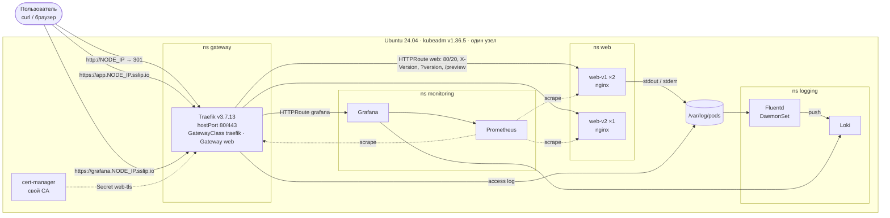

# kube-gateway-stand

Однокомандное развёртывание Kubernetes-кластера (kubeadm) на чистой Ubuntu 24.04 с публикацией
веб-приложения через **Gateway API** (Traefik), TLS от cert-manager, мониторингом
(kube-prometheus-stack) и централизованными логами (Fluentd → Loki → Grafana).

```bash
git clone https://github.com/DverkuOff/kube-gateway-stand.git
cd kube-gateway-stand
make deploy      # = sudo ./deploy.sh — идемпотентно, повторный запуск безопасен
make check       # сквозная проверка: кластер, Gateway API, TLS, маршруты, метрики, логи
```

## Содержание

1. [Кратко](#кратко)
2. [Архитектура](#архитектура)
3. [Технологии и версии](#технологии-и-версии)
4. [Kubernetes](#kubernetes)
5. [Gateway API](#gateway-api)
6. [Требования к среде](#требования-к-среде)
7. [Установка по шагам](#установка-по-шагам)
8. [Проверка приложения](#проверка-приложения)
9. [Проверка мониторинга](#проверка-мониторинга)
10. [Проверка логов](#проверка-логов)
11. [Дополнительные возможности](#дополнительные-возможности)
12. [Почему так](#почему-так)
13. [Повторный запуск и удаление](#повторный-запуск-и-удаление)
14. [Известные ограничения](#известные-ограничения)
15. [Структура репозитория](#структура-репозитория)

## Кратко

- **Кластер:** kubeadm v1.36.5, один узел (control plane без taint), containerd из архива Ubuntu, Calico.
- **Приложение:** nginx (`nginxinc/nginx-unprivileged`) в двух версиях — `v1` (2 реплики) и `v2` (1 реплика).
  Отвечает `Hello World! (v1)` / `Hello World! (v2)` и пишет access-лог в JSON.
- **Вход:** Traefik как реализация Gateway API: GatewayClass, Gateway, HTTPRoute.
  HTTP → HTTPS (301), TLS со своим CA, маршруты по заголовку, query-параметру и пути,
  canary-разбивка 80/20, rate limit.
- **Наблюдаемость:** Prometheus собирает метрики шлюза, приложения, узла и control plane;
  Fluentd собирает логи приложения и шлюза в Loki; всё видно в одной Grafana.
- **Автоматизация:** `sudo ./deploy.sh` (или `make deploy`): bash-стадии, Helm 4, все версии в
  [`versions.env`](versions.env). Повторный запуск ничего не меняет (`changed=0`).
- **Проверка:** `make check` — 25 пронумерованных проверок, PASS/FAIL, ненулевой код выхода при ошибке.

## Архитектура



Коротко о потоках:

- **Трафик.** Клиент → `NODE_IP:443` (hostPort пода Traefik) → TLS-терминация сертификатом
  `*.<NODE_IP>.sslip.io` → HTTPRoute → Service `web-v1` / `web-v2` → nginx `:8080`.
  `http://` на любом хосте отдаёт 301 на `https://`. Адрес узла Traefik записывает в `Gateway.status.addresses`.
- **Метрики.** Prometheus (Prometheus Operator) находит цели через ServiceMonitor/PodMonitor:
  Traefik, nginx-exporter приложения, node-exporter, kubelet/cAdvisor, apiserver, scheduler,
  controller-manager, CoreDNS, kube-state-metrics, cert-manager, Fluentd, Loki.
- **Логи.** nginx пишет access-лог (JSON) в stdout и error-лог в stderr, Traefik пишет access-лог в JSON.
  Fluentd читает `/var/log/pods` (только на чтение), добавляет метаданные Kubernetes, разбирает JSON
  и отправляет в Loki. Grafana читает Loki как datasource.

Подробнее (namespaces и PSA, порядок стадий, безопасность) — в [docs/architecture.md](docs/architecture.md).

## Технологии и версии

Все версии закреплены в [`versions.env`](versions.env). Это единственное место, где они меняются.

| Слой | Компонент | Версия |
|---|---|---|
| ОС | Ubuntu Server LTS (cgroup v2) | 24.04 |
| Рантайм | containerd, runc из архива Ubuntu (`noble-updates`), apt hold | ≥ 2.0 (проверяется), pause 3.10.2 |
| Рантайм (вариант) | `containerd.io` из репозитория Docker (`CONTAINERD_SOURCE=docker`) | 2.3.6 |
| Kubernetes | kubeadm, kubelet, kubectl из pkgs.k8s.io | v1.36.5 |
| CNI | Calico (tigera-operator, VXLAN) | v3.32.2 |
| Хранилище | local-path-provisioner | v0.0.37 |
| Gateway API | CRD, standard channel | v1.6.2 |
| Реализация Gateway API | Traefik (чарт `traefik/traefik` 41.6.1) | v3.7.13 |
| TLS | cert-manager | v1.21.2 |
| Приложение | nginx-unprivileged | 1.30.5-alpine |
| Метрики приложения | nginx-prometheus-exporter (sidecar) | 1.5.3 |
| Мониторинг | kube-prometheus-stack | 91.9.0 |
| | Prometheus / Grafana / Prometheus Operator | v3.15.0 / 13.2.3 / v0.94.1 |
| | kube-state-metrics / node-exporter | 2.20.0 / 1.12.1 |
| Логи, хранилище | Loki (чарт `grafana-community/loki` 18.13.7) | 3.7.8 |
| Логи, агент | Fluentd (чарт `fluent/fluentd` 0.6.0), образ `fluent/fluentd-kubernetes-daemonset` + `fluent-plugin-grafana-loki` 1.3.0 | v1.19.3 |
| Автоматизация | Helm, bash, GNU Make | v4.3.0 |
| CI | GitHub Actions: shellcheck, yamllint, actionlint, helm lint, kubeconform, buildx | — |

Образ Fluentd с плагином Loki собирается в CI из [`images/fluentd/`](images/fluentd/) под amd64 и arm64
и публикуется в GHCR: `ghcr.io/dverkuoff/kube-gateway-stand/fluentd-loki:v1.19.3-loki1.3.0`.

## Kubernetes

| | |
|---|---|
| Версия | **v1.36.5** |
| Способ создания | **kubeadm** (`kubeadm init` с конфигом из [`templates/kubeadm-config.yaml.tpl`](templates/kubeadm-config.yaml.tpl)), один узел |
| kube-proxy | режим iptables |
| Сети | pod `10.244.0.0/16`, service `10.96.0.0/16` (preflight проверяет пересечение с сетями хоста) |
| CNI | Calico v3.32.2, VXLAN, BGP выключен, portmap для hostPort |
| Хранилище | local-path-provisioner (StorageClass по умолчанию) для PVC Prometheus и Loki |
| ОС, на которой проверено | Ubuntu 24.04 LTS amd64 <!-- OUTPUT: точная версия (lsb_release -d, uname -r) и ресурсы ВМ, на которой прошёл финальный прогон --> |

```text
<!-- OUTPUT: kubectl get nodes -o wide -->
```

## Gateway API

- **Реализация:** Traefik **v3.7.13** (Helm-чарт `traefik/traefik` 41.6.1),
  controllerName `traefik.io/gateway-controller`.
- **Версия Gateway API:** **v1.6.2**, standard channel. CRD применяются отдельно (server-side apply),
  а не из чарта Traefik, поэтому обновляются при повторном запуске.
- **Как опубликован шлюз:** под Traefik слушает hostPort 80/443 на IP узла, Service типа ClusterIP.
  Облачный LoadBalancer и MetalLB не нужны. IP узла записывается в `Gateway.status.addresses`
  (`providers.kubernetesGateway.statusAddress.ip`).

Используемые ресурсы:

| Ресурс | Где | Что делает |
|---|---|---|
| `GatewayClass traefik` | [charts/platform](charts/platform/templates/gatewayclass.yaml) | привязка к контроллеру Traefik |
| `Gateway web` (ns `gateway`) | [charts/platform](charts/platform/templates/gateway.yaml) | listener `http` :80 (только маршруты своего ns) и `https` :443 (TLS Terminate, `certificateRefs: web-tls`, маршруты из ns с меткой `gateway-access=true`) |
| `HTTPRoute http-redirect` (ns `gateway`) | [charts/platform](charts/platform/templates/http-redirect.yaml) | `RequestRedirect` на https, код 301 |
| `HTTPRoute web` (ns `web`) | [charts/web](charts/web/templates/httproute.yaml) | хост `app.<NODE_IP>.sslip.io`; `X-Version: v2` → v2; `?version=v2` → v2; `/preview` + `URLRewrite` → v2; `/` → v1/v2 с весами 80/20 |
| `HTTPRoute grafana` (ns `monitoring`) | [charts/observability](charts/observability/templates/grafana-httproute.yaml) | второй hostname `grafana.<NODE_IP>.sslip.io`, маршрут из другого namespace |
| `Middleware rate-limit` (traefik.io) | [charts/web](charts/web/templates/middleware.yaml) | rate limit 20 rps, burst 40 — подключён к правилам HTTPRoute через фильтр `ExtensionRef` |

На всех правилах `HTTPRoute web` также стоит `ResponseHeaderModifier` (HSTS, `X-Content-Type-Options`).

```text
<!-- OUTPUT: kubectl get gatewayclass,gateway -A ; kubectl get httproute -A -->
```

## Требования к среде

| | Минимум | Рекомендуется |
|---|---|---|
| ОС | Ubuntu 24.04 LTS, чистая установка, systemd, cgroup v2 | то же |
| Архитектура | amd64 | amd64 (arm64 — образы multi-arch, но полный прогон не проверялся) |
| CPU / RAM | 2 vCPU / 4 ГБ с `PROFILE=small` | 4 vCPU / 8 ГБ |
| Диск | 30 ГБ свободно | 40 ГБ <!-- OUTPUT: фактическое занятое место после деплоя (df -h /) --> |
| Доступ | `sudo` | — |
| Порты | 80, 443, 6443 свободны | — |
| Сеть | доступ в интернет к `pkgs.k8s.io`, `get.helm.sh`, `github.com`, `registry.k8s.io`, `quay.io`, `ghcr.io`, `mirror.gcr.io` / `docker.io`, `traefik.github.io`, `prometheus-community.github.io`, `grafana-community.github.io`, `fluent.github.io`; DNS `sslip.io` (для браузера) | — |

Заранее ставить ничего не нужно: `deploy.sh` сам ставит containerd, kubeadm/kubelet/kubectl, Helm, `jq`, `curl`.
Хост должен быть «своим»: на нём не должно быть другого Kubernetes. Swap выключается стадией подготовки узла.
<!-- VERIFY (трек A): что именно делает preflight со swap, Docker и чужим containerd — поправить формулировку -->

## Установка по шагам

1. Клонировать репозиторий:

   ```bash
   git clone https://github.com/DverkuOff/kube-gateway-stand.git
   cd kube-gateway-stand
   ```

2. Запустить развёртывание (спросит пароль sudo):

   ```bash
   make deploy          # то же, что sudo ./deploy.sh
   ```

   Необязательные параметры передаются через окружение:

   | Переменная | По умолчанию | Назначение |
   |---|---|---|
   | `NODE_IP` | адрес источника маршрута по умолчанию | IP узла, на котором публикуется шлюз |
   | `PROFILE` | `default` | `small` — меньше requests и хранение для 2 vCPU / 4 ГБ |
   | `POD_CIDR` / `SVC_CIDR` | `10.244.0.0/16` / `10.96.0.0/16` | сети кластера |
   | `DOCKERHUB_MIRROR` | `https://mirror.gcr.io` | зеркало для docker.io; `""` — тянуть напрямую |
   | `CONTAINERD_SOURCE` | `ubuntu` | `docker` — использовать уже установленный `containerd.io` |
   | `ONLY_STAGES` | все | подмножество стадий, например `"40-app 50-monitoring"` |

   Пример: `sudo PROFILE=small ./deploy.sh`.

3. Стадии выполняются по порядку. Каждая сначала проверяет состояние и меняет только разницу:

   | Стадия | Что делает |
   |---|---|
   | `00-preflight` | ОС, ресурсы, cgroup v2, свободные порты, пересечение сетей, доступ к реестрам |
   | `10-node` | модули и sysctl ядра, containerd, kubeadm/kubelet/kubectl (hold), Helm |
   | `20-cluster` | `kubeadm init`, kubeconfig пользователя (`~/.kube/config`), Calico, local-path |
   | `30-platform` | CRD Gateway API и Prometheus Operator, namespaces с PSA, cert-manager, Traefik, GatewayClass/Gateway, TLS |
   | `40-app` | приложение v1/v2, HTTPRoute, rate limit, NetworkPolicy |
   | `50-monitoring` | Secret Grafana, kube-prometheus-stack, дашборды, алерты, маршрут Grafana |
   | `60-logging` | Loki, Fluentd |

4. В конце `deploy.sh` печатает адреса и следующие команды:

   ```text
   <!-- OUTPUT: последние строки вывода make deploy (Done: ok=.. changed=.., Elapsed, блок access) -->
   ```

   Время первого развёртывания: <!-- OUTPUT: Elapsed первого прогона на 4 vCPU / 8 ГБ -->.

5. Проверить всё одной командой (от обычного пользователя, без sudo):

   ```bash
   make check
   ```

### Команды

| Команда | Что делает |
|---|---|
| `make deploy` | развернуть или довести до нужного состояния (идемпотентно) |
| `make check` | сквозная проверка, PASS/FAIL по каждому пункту |
| `make creds` | адреса и логин/пароль Grafana |
| `make demo-logs` | запрос с уникальным `X-Request-ID` и поиск его в Loki |
| `make demo-metrics` | сгенерировать трафик и вывести ключевые PromQL-запросы |
| `make canary W=50` | изменить долю трафика на v2 (0–100) |
| `make destroy` | удалить кластер с хоста (спросит подтверждение; `YES=1` — без вопроса) |
| `make lint` | статические проверки (shellcheck, yamllint, helm lint, kubeconform, actionlint) |

## Проверка приложения

### Автоматически

`make check` берёт все данные из кластера (IP узла — из статуса Gateway `web`, хосты — из HTTPRoute,
CA — из `out/ca.crt`) и проверяет:

| № | Проверка |
|---|---|
| 1 | узел Ready и версия Kubernetes; все поды Ready; релизы Helm в статусе deployed |
| 2 | GatewayClass Accepted; Gateway `web` Programmed и адрес = IP узла; все HTTPRoute Accepted и ResolvedRefs |
| 3 | `http://NODE_IP` → 301 на https; `https://app…` → 200 и `Hello World!`, сертификат проверяется по CA (без `-k`) |
| 4 | `X-Version: v2`, `?version=v2`, `/preview` → v2; разбивка 200 запросов совпадает с весами HTTPRoute (±8 п.п.) |
| 5 | залп параллельных запросов получает 429, после паузы снова 200 |
| 6 | несуществующий путь → 404 |
| 7 | все цели Prometheus up, ключевые job на месте, `traefik_service_requests_total` растёт с трафиком |
| 8 | запрос с уникальным `X-Request-ID` находится в Loki в логах шлюза и приложения (≤ 30 с) |
| 9 | Prometheus/Loki не опубликованы; Grafana требует логин; метки PSA; NetworkPolicy; порты 2381 (etcd) и 9100 (node-exporter) без аутентификации закрыты |

```text
<!-- OUTPUT: вывод make check целиком (25 passed, 0 failed) -->
```

### Вручную (curl)

```bash
NODE_IP=$(kubectl get gateway web -n gateway -o jsonpath='{.status.addresses[0].value}')
APP=app.$NODE_IP.sslip.io
CURL="curl -s --cacert out/ca.crt --resolve $APP:443:$NODE_IP"   # --resolve: не зависеть от DNS

curl -sI http://$NODE_IP/ | head -3              # 301, Location: https://...
$CURL https://$APP/                              # Hello World! (v1) или (v2) — проверка TLS без -k
$CURL -H 'X-Version: v2' https://$APP/           # Hello World! (v2)
$CURL "https://$APP/?version=v2"                 # Hello World! (v2)
$CURL https://$APP/preview                       # Hello World! (v2)
for i in $(seq 100); do $CURL https://$APP/; sleep 0.1; done | sort | uniq -c   # ≈ 80 / 20 (пауза — чтобы не упереться в rate limit)
$CURL -o /dev/null -w '%{http_code}\n' https://$APP/nope            # 404
seq 100 | xargs -P 50 -I{} $CURL -o /dev/null -w '%{http_code}\n' https://$APP/ | sort | uniq -c  # есть 429
```

```text
<!-- OUTPUT: фактический вывод команд выше -->
```

Доверить CA в браузере: импортировать `out/ca.crt` (файл создаётся при развёртывании и принадлежит
пользователю, запустившему `sudo`). Без импорта браузер покажет предупреждение о сертификате.

Изменить долю canary: `make canary W=50` (затем `make check` проверит новую разбивку по весу из HTTPRoute).

## Проверка мониторинга

**Что собирается.** Prometheus (kube-prometheus-stack, хранение 2 дня / 2 ГБ, PVC 5 ГБ) скрейпит:

| Job / цель | Что даёт |
|---|---|
| Traefik (`:9100/metrics`) | HTTP-метрики шлюза: запросы, коды ответов, latency по каждому backend (v1 и v2 раздельно), 429 и 404 |
| `web` (nginx-prometheus-exporter `:9113`) | соединения и запросы nginx по каждому поду, метка `version` |
| node-exporter (через kube-rbac-proxy, HTTPS + токен) | CPU, память, диск, сеть узла |
| kubelet / cAdvisor | CPU и память контейнеров |
| apiserver, kube-scheduler, kube-controller-manager | control plane (scheduler и controller-manager по HTTPS с аутентификацией) |
| CoreDNS, kube-state-metrics | DNS и состояние объектов Kubernetes |
| cert-manager | срок действия сертификатов |
| Fluentd, Loki | работа конвейера логов |

etcd и kube-proxy отдают метрики только на `127.0.0.1` и не скрейпятся. Задержки etcd видны через
метрики apiserver (`etcd_request_duration_seconds`, `apiserver_storage_*`).

**Где смотреть.** Grafana: `https://grafana.<NODE_IP>.sslip.io` (логин и пароль — `make creds`).
Дашборды: стандартные дашборды kube-prometheus-stack (узел, поды, control plane), «Traefik»
и «Web: golden signals» (RPS, коды, p95, доля canary, 429). Prometheus наружу не публикуется,
его API доступен через API-сервер Kubernetes:

```bash
prom() { kubectl get --raw "/api/v1/namespaces/monitoring/services/kps-prometheus:http-web/proxy/api/v1/query?query=$(jq -rn --arg q "$1" '$q|@uri')" | jq '.data.result'; }
prom 'count by (job) (up == 1)'
```

Или одной командой: `make demo-metrics` (генерирует трафик и печатает результаты запросов).

**PromQL** (Grafana → Explore → Prometheus):

```promql
# все цели и их состояние
count by (job) (up == 1)

# запросы в секунду к приложению по кодам ответа (данные шлюза)
sum by (code) (rate(traefik_service_requests_total{service=~".*-svc-web-web-v[12]-.*"}[1m]))

# фактическая доля canary v2
sum(rate(traefik_service_requests_total{service=~".*-svc-web-web-v2-.*"}[5m]))
  / sum(rate(traefik_service_requests_total{service=~".*-svc-web-web-v[12]-.*"}[5m]))

# p95 latency по версиям
histogram_quantile(0.95, sum by (le, service) (rate(traefik_service_request_duration_seconds_bucket{service=~".*-svc-web-web-v[12]-.*"}[5m])))

# ответы 429 от rate limit
sum(rate(traefik_router_requests_total{code="429"}[1m]))

# память подов приложения
sum by (pod) (container_memory_working_set_bytes{namespace="web", container!=""})

# CPU узла
1 - avg(rate(node_cpu_seconds_total{mode="idle"}[5m]))
```

```text
<!-- OUTPUT: make demo-metrics (фактические значения) -->
```

**Алерты** (PrometheusRule, видны в Grafana → Alerting и в Prometheus): доля 5xx у приложения,
p95 latency, недоступность Traefik, скорое истечение и неготовность сертификата, а также стандартные
правила kube-prometheus-stack. Alertmanager выключен, уведомления никуда не отправляются (см. ограничения).
<!-- VERIFY (трек C/D): итоговый список алертов, в т.ч. правила для Fluentd/Loki -->

## Проверка логов

**Какие логи.**

| Источник | Формат | Поток |
|---|---|---|
| access-лог nginx (приложение) | JSON: `time`, `request_id`, `remote_addr`, `xff`, `method`, `uri`, `status`, `bytes`, `request_time`, `ua`, `host`, `version` | stdout |
| error-лог nginx | текст (`... [error] ... open() ... failed`) | stderr |
| access-лог Traefik (шлюз) | JSON, включая `X-Request-Id`, `DownstreamStatus`, `RequestPath` | stdout |

`request_id` в логе nginx берётся из входящего заголовка `X-Request-ID` (если его нет — генерируется nginx),
поэтому один запрос находится и в логе шлюза, и в логе приложения.

**Куда идут.** kubelet пишет stdout/stderr контейнеров в `/var/log/pods` → Fluentd (DaemonSet, монтирует
только `/var/log/pods` и `/var/log/containers` на чтение) разбирает формат CRI, добавляет метаданные
Kubernetes, разбирает JSON и error-лог → Loki (Monolithic, PVC 5 ГБ, хранение 72 ч) → Grafana.
Метки Loki: `namespace`, `container`, `stream`, `log_type` (`access` / `error` / `other`).
Время события берётся из самого JSON-лога, а не из записи CRI.

**Как проверить.**

```bash
make demo-logs
```

Скрипт отправляет запрос с уникальным `X-Request-ID` и через API-сервер находит этот запрос в Loki —
в логе шлюза и в логе приложения.

```text
<!-- OUTPUT: вывод make demo-logs -->
```

Вручную:

```bash
RID=demo-$RANDOM
curl -s --cacert out/ca.crt --resolve $APP:443:$NODE_IP -H "X-Request-ID: $RID" https://$APP/
sleep 5
Q=$(jq -rn --arg q "{namespace=~\"web|gateway\"} |= \"$RID\"" '$q|@uri')
kubectl get --raw "/api/v1/namespaces/logging/services/loki:3100/proxy/loki/api/v1/query_range?query=$Q&limit=10" \
  | jq -r '.data.result[] | .stream.namespace + "  " + .values[0][1]'
```

**LogQL** (Grafana → Explore → Loki):

```logql
# один запрос в логах шлюза и приложения
{namespace=~"web|gateway"} |= "<X-Request-ID>"

# access-лог приложения, ошибки клиента и сервера
{namespace="web", log_type="access"} | json | status >= 400

# error-лог nginx (например, после запроса к несуществующему пути)
{namespace="web", log_type="error"}

# ответы 429 на шлюзе
{namespace="gateway", log_type="access"} | json | DownstreamStatus = 429

# запросов в минуту по версиям
sum by (version) (count_over_time({namespace="web", log_type="access"} | json [1m]))
```

## Дополнительные возможности

**Gateway API**
- Два hostname на одном Gateway (`app.…` и `grafana.…`), маршрут из другого namespace по метке `gateway-access=true`.
- Маршрутизация по заголовку (`X-Version: v2`), query-параметру (`?version=v2`) и пути (`/preview` с `URLRewrite`).
- Несколько backend и traffic splitting 80/20; `make canary W=…` меняет веса, PromQL показывает фактическую долю.
- TLS Terminate с сертификатом cert-manager (свой CA, ECDSA), редирект HTTP → HTTPS (301), HSTS.
- Rate limit (Traefik Middleware через `ExtensionRef`) → 429.

**Мониторинг и логи**
- HTTP-метрики шлюза: запросы, коды, latency по каждому backend, 429/404, которые не доходят до приложения.
- Метрики control plane по HTTPS с аутентификацией; node-exporter за kube-rbac-proxy.
- Дашборды Grafana: Traefik, «Web: golden signals», стандартные CPU/RAM узла и подов.
- Алерты (PrometheusRule): ошибки, latency, доступность шлюза, сертификаты.
- Централизованные логи в Loki, сквозной `request_id` между шлюзом и приложением, поиск в Grafana.

**CI/CD** (GitHub Actions, actions закреплены по SHA)
- `lint`: shellcheck, yamllint, actionlint, проверка JSON дашбордов, `helm lint` и `helm template | kubeconform` (с CRD-схемами) — то же, что `make lint`.
- `image`: сборка образа Fluentd (amd64 + arm64), smoke-тест конфигурации, публикация в GHCR с provenance и SBOM.
- `e2e` (ручной запуск): полный `deploy.sh` на чистом раннере ubuntu-24.04 → `make check` → повторный деплой с `changed=0` → `make check`.
<!-- VERIFY (трек E): статус e2e на момент сдачи, ссылка на зелёный прогон -->

**Надёжность и безопасность**
- Pod Security Admission: `web` и `cert-manager` — restricted; `gateway` (hostPort), `monitoring` (node-exporter),
  `logging` (hostPath) — privileged, но с warn/audit=restricted, чтобы любое послабление было видно.
- NetworkPolicy default-deny в `web`: входящий трафик только от шлюза (HTTP) и Prometheus (метрики).
- Поды приложения: non-root, read-only rootfs, drop ALL, seccomp RuntimeDefault, probes, requests/limits, PDB.
- Prometheus, Loki и дашборд Traefik наружу не публикуются; Grafana — только с логином, анонимный доступ выключен.
- Пароль Grafana генерируется при развёртывании и хранится в Secret (создаётся через stdin, в git и в логах его нет).
- Grafana sidecar читает только ConfigMap своего namespace, без доступа к Secret.
- etcd и kube-proxy отдают метрики только на `127.0.0.1`.
- Закреплённые версии всех компонентов, apt hold и пиннинг пакетов Kubernetes.

## Почему так

| Решение | Альтернативы | Почему |
|---|---|---|
| **kubeadm** | kind, minikube, k3d | приоритет кейса; настоящий кластер с control plane, который можно мониторить |
| **Traefik** как реализация Gateway API | NGINX Gateway Fabric, Envoy Gateway | Traefik отдаёт HTTP-метрики шлюза из коробки: запросы, коды, latency по каждому backend (доля canary считается в PromQL), видит 429 и 404. В OSS-версии NGF этих метрик нет (только stub_status). Conformance Traefik покрывает всё, что используется здесь (core + redirect, rewrite, query matching, header modifier). Цена — rate limit через собственный Middleware Traefik |
| **hostPort 80/443 + statusAddress** | MetalLB, NodePort, externalIPs | не нужен свободный IP в сети эксперта и облачный LB; стандартные порты; externalIPs устарели и небезопасны |
| **Calico** | Flannel, Cilium | поддерживает NetworkPolicy, ставится официальным оператором, работает с iptables kube-proxy |
| **cert-manager со своим CA + sslip.io** | Let's Encrypt, openssl в скрипте | публичный DNS и ACME в сети эксперта недоступны; cert-manager продлевает сертификат сам; CA выгружается, и curl проверяет TLS без `-k` |
| **nginx-unprivileged** | своё приложение, podinfo | классические access/error-логи, ровно то, что просит кейс; non-root образ под много архитектур; HTTP-метрики берутся со шлюза |
| **kube-prometheus-stack** | VictoriaMetrics, голый Prometheus | стандарт, привычный экспертам; Operator, дашборды и правила из коробки |
| **Fluentd → Loki** | Filebeat → Elasticsearch/OpenSearch | Loki лёгкий (одна реплика, файловое хранилище), метрики и логи в одной Grafana; Elasticsearch/OpenSearch на одном небольшом узле тяжелы (JVM) |
| **bash + Make + Helm 4** | Ansible, helmfile, Argo CD/Flux | на хосте эксперта ничего не нужно ставить заранее; каждая стадия читается как обычный скрипт; идемпотентность обеспечивают проверки и `kubectl diff` / хэш входов Helm |
| **etcd-метрики только на localhost** | `0.0.0.0:2381` | этот порт отдаёт метрики по HTTP без аутентификации; задержки etcd видны через apiserver |
| **containerd из архива Ubuntu** | бинарники с GitHub | только официальные репозитории, обновления безопасности через apt; Kubernetes 1.36 требует containerd ≥ 2.0 — версия проверяется |

## Повторный запуск и удаление

- **Повторный запуск** `make deploy` безопасен: каждая стадия проверяет текущее состояние и меняет только
  разницу. Helm-релизы не обновляются, если не изменились версия чарта и входные значения
  (ревизии в `helm list` не растут), манифесты применяются через `kubectl diff` + server-side apply.
  Итог печатается как `Done: ok=N changed=M`; на развёрнутой системе `changed=0`.

  ```text
  <!-- OUTPUT: хвост вывода повторного make deploy (changed=0) -->
  ```

- **Восстановление.** Если удалить, например, Secret Grafana или Deployment приложения, повторный
  `make deploy` вернёт их. Если прошлый запуск прервался, повторный продолжит с текущего состояния.
- **Частичный запуск:** `sudo ONLY_STAGES="40-app" ./deploy.sh`.
- **Удаление:** `make destroy` (спросит подтверждение, `make destroy YES=1` — без вопроса) — сбрасывает
  кластер (`kubeadm reset`), чистит CNI и данные PVC на узле.
  <!-- VERIFY (трек A): что именно удаляет destroy.sh (пакеты, kubeconfig пользователя, /var/lib/kube-gateway-stand) -->
- **С нуля:** `make destroy YES=1 && make deploy`.

## Известные ограничения

- **Один узел, без HA.** Control plane и нагрузка на одном узле; нет резервного копирования etcd.
- **Поддерживается только Ubuntu 24.04** на «чистом» хосте. WSL, контейнеры и хосты с уже работающим Kubernetes не поддерживаются.
- **arm64** не проверялся полным прогоном (все образы multi-arch, образ Fluentd собирается под arm64).
- **HTTP-прокси** для доступа в интернет не поддерживается.
- **DNS sslip.io.** Хосты `*.<NODE_IP>.sslip.io` требуют работающего DNS; некоторые резолверы режут ответы с частными IP
  (защита от DNS rebinding). Обход — `curl --resolve` (так делает `make check`) или запись в `/etc/hosts`.
- **Самоподписанный CA.** Браузер доверяет сайтам только после импорта `out/ca.crt`.
- **Смена IP узла** после установки не поддерживается (адрес вшит в сертификаты kubeadm и хосты); нужно `make destroy && make deploy`.
- **Docker Hub** по умолчанию идёт через зеркало `mirror.gcr.io`; если зеркало недоступно, задайте `DOCKERHUB_MIRROR=""`.
- **Alertmanager выключен** ради памяти: алерты вычисляются и видны в Prometheus/Grafana, но никуда не отправляются.
- **Хранение:** метрики 2 дня / 2 ГБ, логи 72 часа. local-path не ограничивает размер PVC — место на диске нужно контролировать.
- **Traefik:** `Gateway.spec.addresses` не поддерживается (адрес задаётся через values чарта); изоляция listener'ов
  по hostname не поддерживается, поэтому hostname задаются в HTTPRoute. Rate limit — Middleware Traefik, а не ресурс Gateway API.
- **Loki** не строит полнотекстовый индекс: поиск по `request_id` — построчный фильтр в пределах выбранных меток.
- **etcd и kube-proxy** не скрейпятся напрямую (метрики только на `127.0.0.1`).

## Структура репозитория

```text
.
├── deploy.sh                  # точка входа: sudo ./deploy.sh (стадии по порядку)
├── Makefile                   # make deploy | check | creds | demo-logs | demo-metrics | canary | destroy | lint
├── versions.env               # все версии компонентов
├── scripts/
│   ├── lib.sh                 # общие функции: ok/changed, kapply, helm_release, wait_for, ...
│   ├── 00-preflight.sh … 60-logging.sh   # стадии развёртывания
│   ├── access-info.sh         # итоговые адреса в конце деплоя
│   ├── check.sh               # make check
│   ├── creds.sh  demo-logs.sh  demo-metrics.sh  canary.sh
│   ├── destroy.sh             # make destroy
│   └── lint.sh                # make lint (то же, что в CI)
├── templates/                 # kubeadm-config и другие шаблоны узла
├── manifests/                 # namespaces (PSA), local-path-provisioner
├── values/                    # values Helm: calico, cert-manager, traefik, kps, loki, fluentd
├── charts/
│   ├── platform/              # GatewayClass, Gateway, редирект, ClusterIssuer/CA/Certificate
│   ├── web/                   # приложение v1/v2, HTTPRoute, Middleware, NetworkPolicy, PDB, ServiceMonitor
│   └── observability/         # маршрут Grafana, дашборды, PrometheusRule
├── dashboards/                # JSON-дашборды Grafana
├── images/fluentd/            # Dockerfile образа Fluentd с плагином Loki
├── docs/architecture.md       # подробная архитектура
├── .github/workflows/         # lint, image, e2e
└── out/                       # создаётся при деплое: ca.crt (в git не попадает)
```

## Лицензия

[MIT](LICENSE)
<!-- VERIFY: тип лицензии в LICENSE -->
