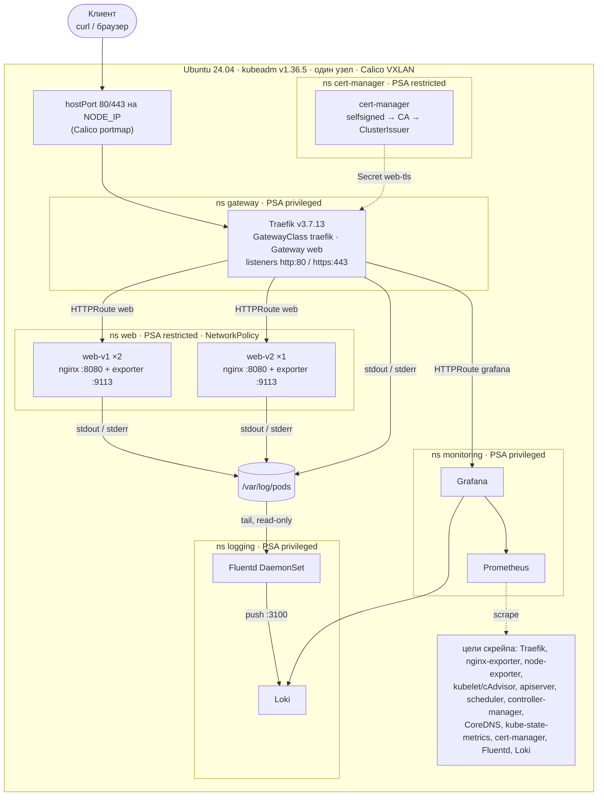
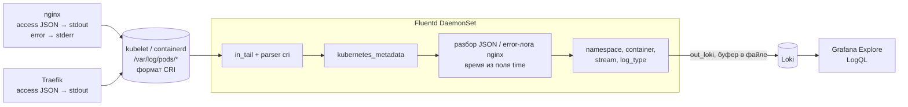

# Архитектура

Документ дополняет [README](../README.md): здесь подробнее о компонентах, потоках трафика, метрик и логов,
namespaces, порядке развёртывания, удалении, безопасности, обосновании выбора компонентов и структуре репозитория.

## Общая схема



## Поток трафика

1. Клиент обращается к `NODE_IP:443` (или `:80`). Calico portmap делает DNAT с hostPort узла на под Traefik.
   Облачный LoadBalancer и MetalLB не используются, Service Traefik имеет тип ClusterIP.
2. Traefik сопоставляет порт с entryPoint (`web` = 80, `websecure` = 443); порты listener'ов Gateway
   совпадают с портами entryPoint'ов.
3. **Listener `http` (:80)** принимает маршруты только из своего namespace `gateway`. Там один HTTPRoute
   `http-redirect` с фильтром `RequestRedirect` (scheme https, 301). Приложения физически не могут
   опубликоваться по HTTP.
4. **Listener `https` (:443)** терминирует TLS сертификатом из Secret `web-tls`
   (`*.<NODE_IP>.sslip.io`, выпущен cert-manager от собственного CA). Маршруты принимаются из namespace
   с меткой `gateway-access: "true"` (`web`, `monitoring`).
5. **HTTPRoute `web`** (хост `app.<NODE_IP>.sslip.io`), правила по порядку специфичности:
   - заголовок `X-Version: v2` → Service `web-v2`;
   - query `?version=v2` → `web-v2`;
   - `PathPrefix /preview` + `URLRewrite ReplacePrefixMatch: /` → `web-v2`;
   - всё остальное (`/`) → `web-v1` вес 80, `web-v2` вес 20 (`make canary W=…` меняет веса).
   На каждом правиле фильтры `ExtensionRef` на Middleware `rate-limit` (20 rps, burst 40 → 429)
   и `ResponseHeaderModifier` (HSTS, `X-Content-Type-Options`).
6. **HTTPRoute `grafana`** (ns `monitoring`, хост `grafana.<NODE_IP>.sslip.io`) → Service `kps-grafana:80`.
7. Service `web-v1` / `web-v2` (порт 80 → targetPort 8080) → поды nginx. NetworkPolicy пускает к `:8080`
   только поды из ns `gateway`, к `:9113` — только из ns `monitoring`.
8. Traefik записывает IP узла в `Gateway.status.addresses` (`statusAddress.ip`), поэтому
   `kubectl get gateway -n gateway` показывает реальный адрес, а `make check` берёт его оттуда.

## Поток метрик

Prometheus управляется Prometheus Operator и подхватывает ServiceMonitor/PodMonitor/PrometheusRule
из всех namespace (селекторы не ограничены меткой релиза). CRD Prometheus Operator ставятся на стадии 30,
до любых чартов, поэтому каждый чарт может сразу создавать свои ServiceMonitor.

| Цель | Как скрейпится | Ключевые метрики |
|---|---|---|
| Traefik | ServiceMonitor чарта Traefik, Service `traefik-metrics` :9100 | `traefik_service_requests_total{code,service}`, `traefik_service_request_duration_seconds_bucket`, `traefik_router_requests_total`, `traefik_entrypoint_*` |
| Приложение | ServiceMonitor `web`, порт `metrics` (:9113, nginx-prometheus-exporter читает stub_status nginx) | `nginx_connections_*`, `nginx_http_requests_total`, метка `version` |
| node-exporter | kube-rbac-proxy на :9100 (HTTPS, TokenReview + SubjectAccessReview); сам exporter слушает 127.0.0.1 | `node_cpu_seconds_total`, `node_memory_*`, `node_filesystem_*` |
| kubelet / cAdvisor | ServiceMonitor kube-prometheus-stack, HTTPS | `container_cpu_usage_seconds_total`, `container_memory_working_set_bytes` |
| apiserver | ServiceMonitor kube-prometheus-stack | `apiserver_request_*`, `etcd_request_duration_seconds`, `apiserver_storage_*` |
| kube-scheduler, kube-controller-manager | HTTPS на `NODE_IP:10259/10257` с токеном ServiceAccount Prometheus (bind-address задан в конфиге kubeadm) | `scheduler_*`, `workqueue_*` |
| CoreDNS, kube-state-metrics | ServiceMonitor kube-prometheus-stack | `coredns_dns_requests_total`, `kube_pod_*`, `kube_deployment_*` |
| cert-manager | ServiceMonitor чарта cert-manager | `certmanager_certificate_expiration_timestamp_seconds`, `certmanager_certificate_ready_status` |
| Fluentd | ServiceMonitor чарта fluentd, :24231 | `fluentd_output_status_*`, `fluentd_input_status_num_records_total` |
| Loki | ServiceMonitor чарта Loki | `loki_distributor_lines_received_total`, `loki_discarded_samples_total` |

Не скрейпятся сознательно: etcd (метрики только на `127.0.0.1:2381` по HTTP без аутентификации) и
kube-proxy (`127.0.0.1:10249`). Задержки etcd видны со стороны apiserver.

Grafana получает datasource Prometheus от kube-prometheus-stack и datasource Loki
(`http://loki.logging.svc.cluster.local:3100`). Дашборды лежат в `dashboards/*.json` и попадают в Grafana
через ConfigMap с меткой `grafana_dashboard: "1"`; sidecar Grafana читает только ConfigMap своего namespace.
Алерты — PrometheusRule в `charts/observability` плюс стандартные правила kube-prometheus-stack.

## Поток логов



- Fluentd монтирует `/var/log/pods` и `/var/log/containers` только на чтение. На запись у него есть только
  `/var/lib/fluentd` на узле (позиции чтения и файловый буфер), поэтому рестарт пода не теряет строки,
  а `make destroy` удаляет этот каталог вместе со старыми логами, чтобы новый кластер не перечитывал их.
- Собственные логи Fluentd не собираются (иначе петля).
- Метки Loki — только с ограниченным набором значений: `namespace`, `container`, `stream`, `log_type`
  (`access`, `error`, `other`); ещё `service_name` Loki 3 добавляет сам. `pod`, `request_id` и поля запроса
  остаются в теле строки и ищутся через `| json`.
- `request_id` связывает строки: nginx берёт его из `X-Request-ID` (через `map`, иначе генерирует сам),
  Traefik пишет заголовок `X-Request-Id` в свой access-лог. `make demo-logs` и `make check` (пункт 8)
  отправляют запрос с уникальным `X-Request-ID` и находят его в Loki через API-сервер
  (`/api/v1/namespaces/logging/services/loki:3100/proxy/...`) — без port-forward.

## Namespaces и Pod Security Admission

| Namespace | enforce | warn / audit | Почему | Метка `gateway-access` |
|---|---|---|---|---|
| `gateway` | privileged | restricted | Traefik слушает hostPort 80/443 | — |
| `web` | **restricted** | restricted | приложение без привилегий | `true` |
| `monitoring` | privileged | restricted | node-exporter: hostNetwork, hostPID, hostPath | `true` (маршрут Grafana) |
| `logging` | privileged | restricted | Fluentd читает логи через hostPath | — |
| `cert-manager` | **restricted** | restricted | чарт по умолчанию соответствует restricted | — |
| `kube-system`, `calico-system`, `tigera-operator`, `local-path-storage` | управляются kubeadm / оператором Calico / манифестом local-path | | | — |

warn/audit = restricted на привилегированных namespace оставляют видимым любое послабление: API-сервер
предупреждает при создании пода (warn) и помечает запрос аннотацией для аудита (audit). Сам аудит-лог API-сервера
в стенде не включён (см. [ограничения в README](../README.md#известные-ограничения)).

## Порядок развёртывания

`deploy.sh` подключает стадии через `source` по порядку. Каждая стадия проверяет состояние, меняет
только разницу и сообщает `ok` / `changed`; повторный запуск даёт `changed=0`.

| # | Стадия | Содержимое | Зависит от |
|---|---|---|---|
| 1 | `00-preflight` | Ubuntu 24.04, cgroup v2, CPU/RAM/диск, свободные порты, пересечение `POD_CIDR`/`SVC_CIDR` с сетями хоста, доступ к реестрам | — |
| 2 | `10-node` | модули ядра и sysctl, swap off, containerd (SystemdCgroup, зеркало docker.io), kubeadm/kubelet/kubectl с hold и пиннингом, Helm с проверкой sha256 | 1 |
| 3 | `20-cluster` | `kubeadm init` (конфиг из шаблона), готовность по `/readyz`, kubeconfig пользователя, Calico, local-path | 2 |
| 4 | `30-platform` | CRD Gateway API v1.6.2 и Prometheus Operator (server-side apply) → namespaces с PSA → cert-manager → Traefik → релиз `platform` (GatewayClass, Gateway, редирект, CA и сертификат), выгрузка `out/ca.crt` | 3 |
| 5 | `40-app` | релиз `web`: Deployments v1/v2, Services, HTTPRoute, Middleware, NetworkPolicy, PDB, ServiceMonitor | 4 |
| 6 | `50-monitoring` | Secret `grafana-admin` → kube-prometheus-stack → релиз `observability` (маршрут Grafana, дашборды, алерты, NetworkPolicy для Prometheus и Loki) | 4 |
| 7 | `60-logging` | Loki → Fluentd | 6 (datasource и ServiceMonitor) |

Публикация приложения (стадии 4–5) не зависит от стека наблюдаемости: если мониторинг или логи не
развернулись, приложение уже доступно через Gateway.

Идемпотентность:
- файлы на узле пишутся через «сгенерировать → сравнить → заменить и перезапустить только при разнице»;
- пакеты ставятся только недостающие и фиксируются apt hold;
- манифесты применяются через `kubectl diff --server-side`, затем server-side apply только при разнице;
- Helm-релиз обновляется, только если изменился хэш входов (чарт, версия, values, `--set`) или из кластера пропал
  какой-то объект его манифеста (его ищет `kubectl get -f` по `helm get manifest`), поэтому ревизии не растут,
  а удалённый руками Deployment или HTTPRoute возвращается;
- релиз, оставшийся в `pending-install`/`pending-upgrade` после убитого `helm` (оборвался SSH), откатывается на
  последнюю рабочую ревизию или удаляется, и только потом обновляется;
- секреты создаются один раз (`kubectl create -f -` через stdin) и восстанавливаются, если их удалили;
  после нового пароля Grafana перезапускается, иначе она осталась бы со старым в своей базе;
- веса canary, изменённые `scripts/canary.sh` прямо в HTTPRoute, стадия `40-app` сравнивает с `CANARY_WEIGHT` и при
  расхождении принудительно обновляет релиз `web` (поды не перезапускаются);
- preflight выбирает `CONTAINERD_SOURCE=docker`, если на хосте уже стоит `containerd.io` от Docker, и останавливается,
  если узел уже инициализирован с другим `NODE_IP` или от прошлого `kubeadm init` остались следы неготового кластера.

Итог каждого запуска — `Done: ok=N changed=M`. На стенде (4 vCPU / 8 ГБ, Ubuntu 24.04.5): первый запуск
`ok=45 changed=48` за 387–459 с (зависит от сети), повторный `ok=90 changed=0` за ~30 с, после перезагрузки узла
`changed=0`.

## Удаление (`make destroy`)

`scripts/destroy.sh` возвращает хост в состояние «пакеты стоят, кластера нет», чтобы следующий `deploy.sh`
создал кластер с нуля:

| Что | Зачем |
|---|---|
| `~/.kube/config`, только если это копия admin.conf | не трогать чужие kubeconfig |
| остановка kubelet, удаление всех pod sandbox, `kubeadm reset` | снять поды до сброса control plane |
| `/var/log/pods`, `/var/log/containers` | иначе static pods продолжают счёт рестартов, а Fluentd перечитывает старые файлы |
| `/var/lib/calico`, `/run/calico`, `/var/log/calico`, `/run/nodeagent`, `vxlan.calico`, `cali*`, маршруты, nft `calico-arp`, ipset `cali*` | состояние CNI |
| цепочки `KUBE-*`, `cali-*`, `CNI-HOSTPORT-*`, `CNI-DN-*`, `CNI-SN-*` в iptables/ip6tables | иначе DNAT hostPort 80/443 остаётся направленным на IP старого пода Traefik |
| `/opt/local-path-provisioner`, `/var/lib/fluentd`, `/var/lib/kube-gateway-stand` | данные PVC, позиции Fluentd, отпечатки Helm и кэш CRD |

Пакеты, настройки ядра (sysctl, модули) и `out/` в репозитории остаются. На полном стеке destroy занимает 3–8 с.
Следующий деплой (образы уже в кэше) на диске 40 ГБ проходит за 225–249 с, сразу после него `make check` даёт 25/25.

## Безопасность

| Мера | Где |
|---|---|
| TLS на входе, 301 с HTTP, HSTS, свой CA, проверка без `-k` | Gateway, HTTPRoute, cert-manager |
| Rate limit 20 rps / burst 40 | Middleware `rate-limit` |
| NetworkPolicy default-deny в `web` | `charts/web` |
| NetworkPolicy для Prometheus и Loki: только из `monitoring` и `logging` (и с самого узла) | `charts/observability` |
| PSA restricted для `web` и `cert-manager`; warn/audit restricted везде | `manifests/namespaces.yaml` |
| Поды приложения: non-root, read-only rootfs, drop ALL, seccomp RuntimeDefault | `charts/web` |
| Prometheus, Loki, дашборд Traefik не публикуются; Grafana с логином, без анонимного доступа | values, `charts/observability` |
| Пароль Grafana генерируется при деплое, хранится только в Secret | стадия 50 |
| Sidecar Grafana: только ConfigMap своего namespace | `values/kps.yaml` |
| etcd/kube-proxy метрики на localhost; scheduler/controller-manager по HTTPS с authn/authz; node-exporter за kube-rbac-proxy | kubeadm, `values/kps.yaml` |
| `DenyServiceExternalIPs` в apiserver | kubeadm |
| Fluentd: `/var/log/pods` и `/var/log/containers` на чтение, запись только в `/var/lib/fluentd`; read-only rootfs, drop ALL | `values/fluentd.yaml` |
| Закреплённые версии, apt hold, проверка sha256 Helm; образ Fluentd с SBOM и provenance | `versions.env`, CI |

## Почему так

| Решение | Альтернативы | Почему |
|---|---|---|
| **kubeadm** | kind, minikube, k3d | приоритет кейса; настоящий кластер с control plane, который можно мониторить |
| **Traefik** как реализация Gateway API | NGINX Gateway Fabric, Envoy Gateway | Traefik из коробки отдаёт HTTP-метрики шлюза: запросы, коды, latency по каждому backend (доля canary считается в PromQL), видит 429 и 404. В OSS-версии NGF этих метрик нет (только stub_status). Conformance Traefik покрывает всё, что используется здесь (core, redirect, rewrite, query matching, header modifier). Цена — rate limit через собственный Middleware Traefik |
| **hostPort 80/443 + statusAddress** | MetalLB, NodePort, externalIPs | не нужен свободный IP в сети эксперта и облачный LB; стандартные порты; externalIPs устарели и небезопасны |
| **Calico** | Flannel, Cilium | поддерживает NetworkPolicy, ставится официальным оператором, работает с iptables kube-proxy |
| **cert-manager со своим CA + sslip.io** | Let's Encrypt, openssl в скрипте | публичный DNS и ACME в сети эксперта могут быть недоступны; cert-manager продлевает сертификат сам; CA выгружается в `out/ca.crt`, и curl проверяет TLS без `-k` |
| **nginx-unprivileged** | своё приложение, podinfo | классические access/error-логи, ровно то, что просит кейс; non-root образ под несколько архитектур; HTTP-метрики берутся со шлюза |
| **kube-prometheus-stack** | VictoriaMetrics, голый Prometheus | стандарт, привычный экспертам; Operator, дашборды и правила из коробки |
| **Fluentd → Loki** | Filebeat → Elasticsearch/OpenSearch | Loki лёгкий (одна реплика, файловое хранилище), метрики и логи в одной Grafana; Elasticsearch/OpenSearch на одном небольшом узле тяжелы (JVM) |
| **bash + Make + Helm 4** | Ansible, helmfile, Argo CD/Flux | на хосте эксперта ничего не нужно ставить заранее; каждая стадия читается как обычный скрипт; идемпотентность обеспечивают проверки, `kubectl diff` и хэш входов Helm |
| **etcd-метрики только на localhost** | `0.0.0.0:2381` | этот порт отдаёт метрики по HTTP без аутентификации; задержки etcd видны через apiserver |
| **containerd из архива Ubuntu** | бинарники с GitHub | только официальные репозитории, обновления безопасности через apt; Kubernetes 1.36 требует containerd ≥ 2.0, версия проверяется. Если на хосте уже есть `containerd.io` от Docker, используется он |

## Структура репозитория

```text
.
├── deploy.sh                  # точка входа: sudo ./deploy.sh (стадии по порядку)
├── Makefile                   # make help | deploy | check | creds | demo-logs | demo-metrics | canary | destroy | lint
├── versions.env               # все версии компонентов и контрольные суммы
├── scripts/
│   ├── lib.sh                 # общие функции: ok/changed, kapply, helm_release, wait_for, ...
│   ├── 00-preflight.sh … 60-logging.sh   # стадии развёртывания
│   ├── access-info.sh         # итоговые адреса в конце деплоя
│   ├── check.sh               # make check
│   ├── creds.sh  demo-logs.sh  demo-metrics.sh  canary.sh
│   ├── destroy.sh             # make destroy
│   └── lint.sh                # make lint (то же, что в CI)
├── templates/                 # шаблон конфига kubeadm
├── manifests/                 # namespaces (PSA), local-path-provisioner
├── values/                    # values Helm: calico, cert-manager, traefik, kps, loki, fluentd (+ *-small)
├── charts/
│   ├── platform/              # GatewayClass, Gateway, редирект, CA и сертификат
│   ├── web/                   # приложение v1/v2, HTTPRoute, Middleware, NetworkPolicy, PDB, ServiceMonitor
│   └── observability/         # маршрут Grafana, дашборды, PrometheusRule, NetworkPolicy Prometheus/Loki
├── dashboards/                # JSON-дашборды Grafana
├── images/fluentd/            # Dockerfile образа Fluentd с плагином Loki
├── docs/                      # architecture.md (этот документ), architecture.svg (схема из README)
├── .github/workflows/         # lint, image, e2e
└── out/                       # создаётся при деплое: ca.crt (в git не попадает)
```
